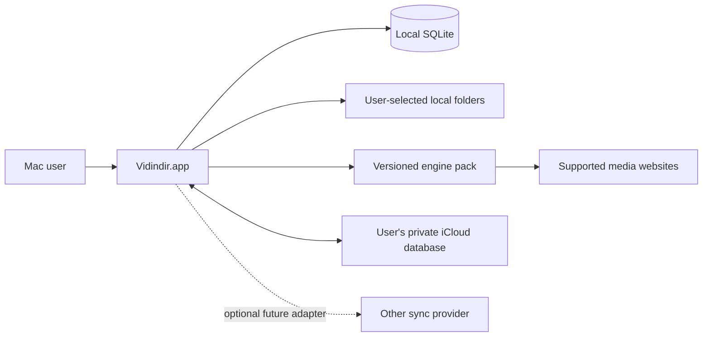
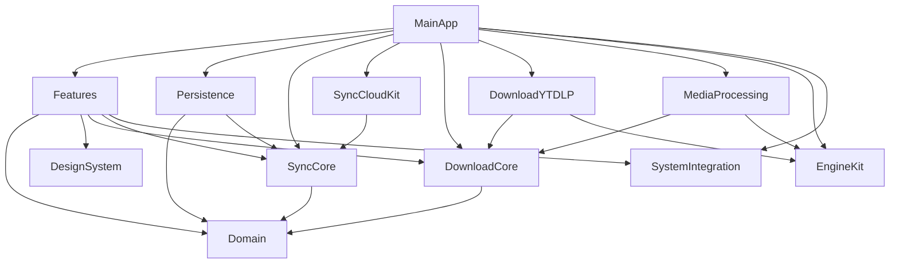

# Vidindir Architecture

Status: foundation specification
Audience: maintainers, feature owners, release engineers, and coding agents
Target: Vidindir 1.0 on macOS 15 or later

This document is the normative system-level architecture for Vidindir. It describes the intended product, not the current single-target prototype. Detailed persistence, synchronization, and download contracts live in [DATA_MODEL.md](DATA_MODEL.md), [SYNC_PROTOCOL.md](SYNC_PROTOCOL.md), and [DOWNLOAD_ENGINE.md](DOWNLOAD_ENGINE.md).

## 1. Architectural intent

Vidindir is a native, local-first macOS media-link library with an optional download capability and optional metadata synchronization. Its core user loop is:

```text
Save -> Organize -> Find -> Share -> Discuss -> Download
```

The first release concentrates on the personal experience: quick capture, Inbox, Library, Collections, Favorites, search, a durable download queue, local file tracking, and iCloud synchronization of lightweight library data.

The following rules are architectural invariants:

1. **The library does not depend on the downloader.** A `MediaItem` remains useful when no backend is installed and when no local file exists.
2. **The database does not depend on a cloud provider.** SQLite is the source of truth. CloudKit and future providers are replication adapters.
3. **The UI does not depend on yt-dlp or FFmpeg.** Features consume domain use cases and backend-neutral events.
4. **Video files are local; links and metadata are syncable.** V1 never uploads downloaded media through Vidindir sync.
5. **Personal and team experiences use the same `Workspace` model.** Personal data is stored in a personal workspace, not in a special global namespace.
6. **Collaboration is always attached to media.** Vidindir will not become a general chat, task-management, or file-hosting product.
7. **Accounts, analytics, ads, and tracking are not prerequisites for core use.** The library and downloader work locally without signing into a Vidindir service.

## 2. Scope and non-goals

### V1 scope

- Native SwiftUI application with selective AppKit integration.
- Link capture through Quick Add, paste, drag and drop, and clipboard suggestions.
- Local Inbox, Library, Collections, Favorites, duplicate detection, and search.
- Single, playlist, and batch download planning through a backend-neutral queue.
- Video/audio presets, quality selection, progress, cancel, pause/resume where supported, retry, and Finder integration.
- SQLite/GRDB persistence and restart-safe jobs.
- Personal-workspace metadata synchronization through CloudKit.
- Independently updateable app and download-engine releases.

### Explicit non-goals

- Downloading or bypassing DRM-protected media.
- General-purpose chat, direct messages, calls, task management, or large-file cloud storage.
- Syncing downloaded video/audio files in V1.
- Making every yt-dlp switch visible in the primary interface.
- Building a YouTube extractor from scratch for V1.
- Supporting non-macOS desktop platforms with the first native client.

## 3. Platform baseline

| Concern | Decision |
| --- | --- |
| Deployment target | macOS 15+ |
| Language | Swift 6.x with complete strict-concurrency checking |
| UI | SwiftUI; AppKit only for capabilities SwiftUI does not expose adequately |
| Persistence | SQLite through GRDB |
| Project generation | Tuist |
| Package/dependency management | Swift Package Manager |
| Concurrency | Swift structured concurrency, actors, `AsyncSequence` |
| Tests | Swift Testing for unit/integration tests; XCUITest for app flows |

AppKit is appropriate for `NSOpenPanel`, security-scoped bookmarks, `NSPasteboard`, Finder reveal, window/toolbar customization, Services, drag-and-drop edge cases, and later Quick Look or share extensions. AppKit types must not leak into Domain or provider-neutral protocols.

Swift 6 `Sendable` correctness is part of the public API design. Mutable long-lived coordinators are actors. Feature presentation models are `@MainActor`. Database records and cross-module events are value types that conform to `Sendable` whenever their fields permit it. `@unchecked Sendable` requires a comment explaining the synchronization mechanism and a concurrency test.

## 4. System context



SQLite is authoritative for the user-visible library. The engine accesses a source website only while resolving metadata or executing a user-requested download. Sync sends only the allow-listed records in `SYNC_PROTOCOL.md`; it does not send source URLs to a Vidindir-operated server.

## 5. Repository and module layout

The target repository layout is:

```text
App/
  MainApp/
Modules/
  Domain/
  Persistence/
  SyncCore/
  SyncCloudKit/
  SyncGoogleDrive/       # future; not a V1 target
  DownloadCore/
  DownloadYTDLP/
  MediaProcessing/
  EngineKit/
  DesignSystem/
  SystemIntegration/
Features/
  QuickAdd/
  Inbox/
  Library/
  Collections/
  Downloads/
  Search/
  Workspaces/
  Settings/
Tests/
  Fixtures/
  IntegrationTests/
  UITests/
Tools/
  EnginePackaging/
  Release/
Docs/
```

Tuist owns the workspace, application, extension, and test-target graph. SwiftPM owns external dependency resolution and may also package stable internal modules. Generated Xcode project files are not a hand-edited collaboration surface. Dependencies are pinned and `Package.resolved` changes are reviewed like source changes.

### Module responsibilities

| Module | Owns | Must not own |
| --- | --- | --- |
| `Domain` | IDs, entities, value types, validation, canonicalization contracts, repository/use-case ports | GRDB, CloudKit, SwiftUI, AppKit, `Process`, yt-dlp flags |
| `Persistence` | GRDB records, migrations, repositories, transactions, FTS, change journal | Provider SDK behavior, UI state, download processes |
| `SyncCore` | Provider-neutral replication orchestration, envelopes, cursors, merge rules, retry policy | CloudKit types, UI, files, downloaded assets |
| `SyncCloudKit` | `CKRecord` mapping, zones, subscriptions, change tokens, CloudKit error mapping | Business entities beyond adapter mapping, conflict policy |
| `DownloadCore` | Jobs, presets, backend protocol, queue/coordinator actor, state transitions, public events | yt-dlp flags, `Process` implementation, SwiftUI |
| `DownloadYTDLP` | yt-dlp resolution/execution adapter, structured event decoding, command construction | Library repositories, feature UI, engine update policy |
| `MediaProcessing` | Backend-neutral media post-processing ports and FFmpeg adapter | Feature presentation and sync |
| `EngineKit` | Engine manifest, download, verification, activation, health check, rollback | Download-job business state, source-specific options |
| `DesignSystem` | Reusable visual tokens and native components | Persistence and backend logic |
| `SystemIntegration` | Clipboard, notifications, Finder, bookmarks, launch/open URL, drag/drop adapters | Domain policy and provider-specific code |
| `Features/*` | Screens and presentation/use-case composition for one feature | Direct GRDB, CloudKit, yt-dlp, or FFmpeg calls |
| `MainApp` | Dependency composition, app/window commands, navigation shell | Reimplementation of module behavior |

### Dependency graph



The arrows mean “may import.” They are intentionally one-way. In particular:

- `SyncCore` declares its storage and provider ports; `Persistence` and `SyncCloudKit` implement them. `SyncCore` never imports either adapter.
- `DownloadCore` declares `DownloadBackend` and post-processing ports; `DownloadYTDLP` and `MediaProcessing` implement them.
- `Domain` imports Foundation only. A narrower custom core package may be extracted later, but is not required for V1.
- Cross-feature imports are forbidden. Shared UI belongs in `DesignSystem`; shared policy belongs in a core module.
- Feature code cannot create global singletons. `MainApp` constructs dependencies and injects them.

CI must include a module-boundary check (for example, a Tuist graph assertion or import linter) so forbidden imports fail before review.

## 6. Runtime composition

`MainApp` builds one `AppEnvironment` at launch. The environment contains protocol-typed use cases and long-lived actors, not raw SDK clients exposed to views.

```text
AppEnvironment
|- LibraryRepository          (Persistence implementation)
|- DownloadCoordinator actor  (DownloadCore)
|- SyncEngine actor           (SyncCore)
|- EngineManager actor        (EngineKit)
|- SearchService              (Persistence/FTS implementation)
|- System services            (clipboard, bookmarks, notifications)
`- Clock/ID/logging adapters   (replaceable in tests)
```

Views issue intents to `@MainActor` feature models. Feature models call use cases. Repository observation and actor events produce immutable snapshots that update the UI. A SwiftUI view never doubles as the durable state of a job or sync operation.

## 7. Primary data flows

### Save a link

1. Quick Add validates an HTTP(S) URL locally.
2. A source canonicalizer derives a canonical URL, source type, and media ID when possible. Resolution failure does not prevent saving a valid URL.
3. Persistence searches duplicate candidates within the workspace.
4. The user opens the existing item or confirms a separate item.
5. A single SQLite transaction inserts `MediaItem`, optional collection membership, and change-journal entries.
6. Metadata resolution runs asynchronously and updates the item in a second transaction.
7. If “Download now” was selected, a durable `DownloadJob` is created for the same `MediaItem`.

### Download on this Mac

1. `DownloadCoordinator` persists a job before launching a process.
2. It resolves the backend and engine version, then advances the state machine.
3. Structured backend events update throttled progress checkpoints.
4. Post-processing completes before the artifact is declared usable.
5. A transaction marks the job completed and creates or updates a device-local `LocalAsset`.
6. A notification and Finder action are presentation concerns layered over the committed state.

### Synchronize a workspace

1. A local library transaction appends provider-neutral journal entries.
2. `SyncEngine` pushes pending envelopes using an idempotency key.
3. The provider returns acknowledgements and remote changes since its cursor.
4. `SyncCore` applies deterministic merge rules through a storage port.
5. Cursor, journal acknowledgement, and merged rows are persisted transactionally where applicable.

Downloaded files, security-scoped bookmarks, `LocalAsset`, `DownloadJob`, progress, caches, and engine paths never enter this flow.

## 8. Persistence boundary

There is one SQLite database per app installation in the app container/Application Support directory. It contains every workspace, including `Personal Workspace`, plus local-only state. GRDB's `DatabasePool` runs in WAL mode with foreign keys enabled. Migrations are ordered, transactional, and exercised against fixtures from every public schema version.

User preferences that are not relational and do not need sync—appearance, clipboard-suggestion toggle, default quality—may remain in `UserDefaults`. Library records, download history, jobs, sync cursors, and engine activation state must not use `UserDefaults` as their authoritative store.

The database must not store a security-scoped path as if it were permanent permission. Folder/file access uses bookmark data managed by `SystemIntegration`; local tables may retain the bookmark plus a human-readable last-known path. See `DATA_MODEL.md`.

## 9. Concurrency and isolation

- `DownloadCoordinator`, `SyncEngine`, and `EngineManager` are actors.
- A coordinator owns mutable lifecycle state for its domain. There is no second mutable copy in a view model.
- GRDB serializes writes through its writer. Multi-row invariants and journal entries share one transaction.
- Long file or network operations do not run in a database transaction or on `MainActor`.
- Cancellation is explicit. Every long-running task checks cancellation and leaves a persisted recoverable state.
- Event streams are bounded or coalesced. Download progress may be rendered frequently but is persisted at most once per configured interval and on state boundaries.
- Public closures crossing isolation boundaries are `@Sendable`; UI callbacks hop to `MainActor` deliberately.

## 10. Filesystem ownership

The exact container prefix varies by signing and sandbox configuration. Logical locations are:

```text
Application Support/Vidindir/
  Library.sqlite
  Library.sqlite-wal
  Library.sqlite-shm
  Engines/
    staging/
    <engine-version>/
  Cache/
    Thumbnails/
  Logs/
```

Downloaded media goes only to a user-approved directory. Temporary downloads are placed in that destination or in an engine-controlled staging directory according to resumability requirements; they are never confused with a completed `LocalAsset`. Cache entries are disposable and excluded from sync and backup when appropriate. Database and user-created library metadata are backed up according to normal macOS container behavior.

Engine activation and downloads must be atomic across crashes: install into a unique staging directory, verify, rename into its immutable version directory, then switch a small activation record. Never modify an active engine pack in place.

## 11. Privacy and security model

Vidindir is not a security boundary against a malicious source website or compromised third-party engine. It reduces risk through process isolation, strict inputs, signed artifacts, least privilege, and auditable network behavior.

Required controls:

- Accept only explicit supported URL schemes; the default is HTTP and HTTPS.
- Launch executables with `Foundation.Process` and argument arrays. Never interpolate a URL into a shell command.
- Put user-provided URLs after the backend's option terminator and ignore ambient yt-dlp config.
- Resolve executables to absolute paths from a verified engine pack. Production builds must not silently prefer arbitrary `PATH` binaries.
- Validate reported artifacts against the authorized destination, including standardized paths and symlink traversal, before recording or revealing them.
- Treat backend output as untrusted and size-bound it. Structured event decoders must reject malformed payloads without crashing.
- Do not write cookies, tokens, signed URLs, query strings, or full command lines to normal logs. Technical export requires explicit user action and redaction.
- Do not install tools or engine updates without an explicit action or an enabled update policy. Verify a signed manifest and every component digest before execution.
- Keep downloaded files local. Sync has an explicit type allow-list rather than a “sync every table” mechanism.
- Ship no analytics or tracking SDK. Any future diagnostics upload is opt-in and requires an ADR and privacy review.

App Sandbox, hardened runtime, code-signing of nested executables, outbound network entitlements, and any user-selected file entitlements must be validated in a signed/notarized release spike before V1 architecture is considered release-ready.

## 12. Failure and recovery

| Failure | Required behavior |
| --- | --- |
| Database migration fails | Do not open a partially migrated library; preserve the original, show recovery guidance, and record a local diagnostic |
| App exits during download | On next launch convert active transient states to `interrupted`; retain partial files; offer resume/retry |
| Engine process crashes | Persist a categorized failure with retryability and sanitized technical detail; keep the library usable |
| Active engine fails health check | Do not activate it; retain and reactivate the last known-good version |
| Destination permission is stale | Resolve/refresh bookmark or ask the user to choose the folder again; do not silently switch destinations |
| Local file is moved/deleted | Mark `LocalAsset` missing after verification; keep `MediaItem` intact |
| Cloud unavailable/account signed out | Continue locally; retain the journal; show non-blocking sync state |
| Sync token expires | Perform bounded zone re-enumeration and idempotent merge; never erase local data as a shortcut |
| Remote record is malformed | Quarantine/report that record, continue the batch where safe, and do not advance past unapplied changes |
| Cache is corrupt | Rebuild it; cache corruption must not affect source records |

Raw terminal messages are never the primary user error. Core layers return stable error categories plus sanitized technical context. Features map categories to actionable language such as “Sign-in required,” “Video unavailable,” “Folder permission lost,” or “Engine update failed.”

## 13. Performance and observability

The architecture must remain responsive with at least 10,000 media items and thousands of relationship rows.

- Use indexed, paginated GRDB queries and FTS for search; do not load the full library into a feature model.
- Decode and cache thumbnails off `MainActor`; cancel work for off-screen items.
- Sync and change-journal processing are incremental and batched.
- Limit concurrent downloads with a user-configurable coordinator policy; resolution and download limits may differ.
- Use `OSLog` categories for app, persistence, sync, download, engine, and integration events. Logs contain identifiers and categories, not sensitive URLs by default.
- Use signposts in development for launch, migrations, search latency, sync batches, metadata resolution, and job completion.

Release acceptance targets should be measured on supported Intel and Apple Silicon hardware before they become hard SLOs. Any concrete latency or memory budget requires an ADR or performance plan with repeatable fixtures.

## 14. Testing strategy

Every module owns unit tests. Cross-module behavior belongs in integration suites; end-user workflows belong in UI tests.

Minimum architecture acceptance tests:

1. The dependency graph fails CI if a feature imports GRDB, CloudKit, `DownloadYTDLP`, or FFmpeg directly.
2. The app launches and browses a seeded 10,000-item library without a network connection or an installed download engine.
3. Creating/updating/deleting a syncable entity writes the row and its change-journal event in one transaction.
4. A crash/relaunch fixture converts in-flight downloads to `interrupted` without losing jobs or library items.
5. Download tests use a fake `DownloadBackend`; feature and coordinator tests make no external media requests.
6. Sync contract tests run the same scenarios against an in-memory fake provider and the CloudKit adapter test seam.
7. Migration tests open each committed database fixture and produce the current schema without data loss.
8. Security tests prove pasted values cannot become process options and reported artifact paths cannot escape the selected destination.
9. No-sync tests prove `LocalAsset`, `DownloadJob`, bookmarks, and engine paths never serialize into remote envelopes.
10. A release-candidate engine pack fails closed after signature, digest, architecture, or health-check failure and rolls back to the prior pack.

Network integration tests against real source sites and CloudKit run in separate, opt-in suites because they are slower, mutable, and may require credentials. Unit CI must be deterministic and offline.

## 15. Current implementation and migration

The repository has crossed the library-persistence foundation and currently has these characteristics:

- A SwiftPM executable plus separate `VidindirDomain` and `VidindirPersistence` targets with dedicated persistence tests.
- Swift tools 6.0, Swift 6 language mode, and a macOS 15 deployment target.
- A native SwiftUI library shell presents Inbox, Library, Favorites, Collections, Downloads, search, Quick Add, inspector, Settings, clipboard capture, and drag and drop.
- `LibraryViewModel` owns feature-facing library state while `AppModel` retains the current one-active-download execution bridge. Both depend on application-owned contracts rather than yt-dlp types.
- SQLite/GRDB is authoritative for media, organization, durable download jobs, local assets, tombstones, FTS search, and sync journal/inbox/outbox boundaries.
- Legacy `DownloadRecord` JSON is imported once and retained as migration evidence; it is no longer the authoritative download history.
- MP4/MP3 destinations use per-format security-scoped bookmarks in `UserDefaults`.
- `YTDLPBackend` translates `YTDLPDownloadService` events into backend-neutral app events. Metadata resolution and download execution use structured yt-dlp output, direct arguments, bounded subprocess capture, and verified artifact containment.
- `HomebrewDownloadEngineManager` places current Homebrew preparation behind the engine-management contract; it is not yet a managed/versioned EngineKit implementation.
- Required tools are discovered in the app bundle, common paths, or `PATH`; missing tools can be installed with Homebrew.
- Packaging creates an ad-hoc-signed `.app` inside a checksum-verified, locally unsigned DMG and does not bundle engine binaries.

Remaining migration must stay incremental and keep the application buildable:

1. Preserve the established macOS 15/Swift 6 baseline and passing deterministic tests while completing the remaining strict-concurrency audit.
2. Move the current application-owned execution contracts into `DownloadCore`; replace the one-active-download bridge with an actor-backed persistent `DownloadCoordinator` supporting scheduling, pause/resume, retry, and concurrency limits.
3. Split remaining process, system-integration, and feature code into the documented package/Tuist boundaries without rewriting proven subprocess/event internals solely to match folder names.
4. Implement `EngineKit` and the verified distribution decision. Keep Homebrew as a clearly labelled preview fallback until signed engine packs pass clean-machine, rollback, licensing, and notarization checks.
5. Implement provider-neutral `SyncCore`, then CloudKit. Sync remains disabled until schema, entitlement, account-change, offline, and destructive-recovery tests pass.
6. Remove the retained legacy `UserDefaults` download history only after an observed public migration window. Preference storage can remain where appropriate.

Do not rewrite working subprocess/event code merely to match folder names. First wrap it in the target interfaces, add contract tests, and then improve internals independently.

## 16. Decisions requiring ADRs

The brief establishes the architecture above, but the following decisions need focused records before implementation or release:

| ADR | Decision needed | Blocking |
| --- | --- | --- |
| ADR-001 | Tuist workspace shape: local Swift packages versus generated framework targets | Modularization |
| ADR-002 | App Sandbox and hardened-runtime design for managed child executables and user-selected folders | Public download release |
| ADR-003 | Engine-pack distribution, signing key rotation, notarization, and binary licensing/source obligations | Self-contained installation |
| ADR-004 | CloudKit container identifier, environments, zone layout, and entitlement ownership | iCloud sync |
| ADR-005 | Clock-skew strategy: V1 wall-clock LWW versus hybrid logical clocks | Multi-device conflict guarantees |
| ADR-006 | Tombstone retention/compaction and proof that offline devices cannot resurrect deleted records | Tombstone GC |
| ADR-007 | Search implementation and tokenizer behavior for multilingual libraries | Search launch quality |
| ADR-008 | Thumbnail cache limits, eviction, and whether remote thumbnails may be prefetched | Privacy/performance |
| ADR-009 | Supported pause semantics for yt-dlp and the UX when a source cannot resume | Pause claim in V1 |
| ADR-010 | Shared-workspace provider and trust/security model | V2 collaboration |

An ADR may refine an implementation detail but cannot silently overturn the architectural invariants in section 1. Changing an invariant requires updating this document, the affected detailed specifications, and migration/testing plans in the same review.

## 17. Definition of architectural readiness

Foundation is ready for parallel feature development when:

- these architecture documents are reviewed and versioned;
- target/module ownership and forbidden imports are encoded in Tuist/CI;
- Domain IDs and core protocols compile under Swift 6 strict concurrency;
- the initial GRDB migration and repository transaction contract are tested;
- fake sync and download adapters support deterministic feature work;
- ADR-001 and the security/release spikes for ADR-002/ADR-003 have owners;
- every agent task declares owned paths, public interfaces, acceptance criteria, required tests, and forbidden paths.

Until then, agents may prototype behind explicit seams, but should not independently invent storage schemas, sync conflict rules, engine formats, or cross-module dependencies.
