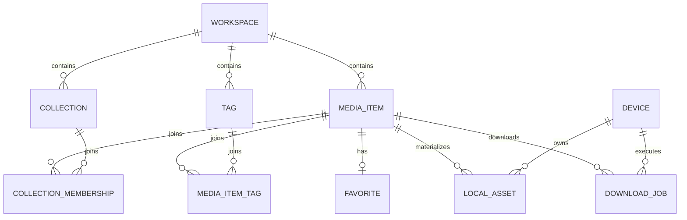

# Vidindir Data Model

Status: foundation specification
Storage: SQLite through GRDB
Target schema name: `library`
Initial schema version: `1`

This document defines the logical and physical data model for the local-first Vidindir library. SQLite is the source of truth. A sync provider receives an explicit subset of records; it never becomes the database.

## 1. Model rules

1. Every user-visible record belongs to a `Workspace`, including personal data.
2. A `MediaItem` describes a link and metadata. It does not prove that a file exists locally.
3. A `LocalAsset` describes one device's file. It is never synchronized.
4. A `DownloadJob` describes durable local work. It is never synchronized.
5. Syncable entities use UUID identity, version metadata, and tombstones.
6. Relationships that users can edit are first-class records so concurrent relationship changes merge independently.
7. A local write and its change-journal entry commit in the same SQLite transaction.
8. Physical deletion of syncable rows is forbidden in V1. A tombstone is a normal versioned record.
9. Duplicate detection informs the user; it is not a database uniqueness constraint. “Add Anyway” must remain possible.
10. File paths and security-scoped access are local capabilities, not portable metadata.

## 2. SQLite and GRDB conventions

The application opens one database with a GRDB `DatabasePool` and applies these connection settings:

```sql
PRAGMA foreign_keys = ON;
PRAGMA journal_mode = WAL;
PRAGMA synchronous = NORMAL;
PRAGMA busy_timeout = 5000;
```

`synchronous = FULL` may be selected for migrations or other durability-critical operations if measurements justify it. The application must not rely on `PRAGMA` defaults.

Physical conventions:

| Concept | SQLite representation |
| --- | --- |
| UUID | lowercase canonical UUID string in `TEXT` |
| Time | UTC Unix epoch milliseconds in `INTEGER` |
| Boolean | `INTEGER NOT NULL` constrained by domain code to `0` or `1` |
| Enum | stable lowercase `TEXT`; unknown future values are preserved or mapped to `.unknown` |
| URL | absolute serialized string in `TEXT` |
| Small versioned payload | canonical UTF-8 JSON in `TEXT` |
| Security-scoped bookmark | opaque `BLOB`, local-only |
| Provider cursor/token | opaque `BLOB`, local-only |

The Persistence module defines GRDB `FetchableRecord`/`PersistableRecord` structs and maps them to Domain values. Domain entities do not import GRDB and do not expose database column names. SQL columns use `snake_case`; Swift uses `lowerCamelCase`.

All migrations are monotonic, named (`v001_initial`, `v002_...`), and transactional. A released migration is immutable. Destructive schema changes use create-copy-validate-rename rather than relying on behavior that varies across SQLite versions.

## 3. Shared version metadata

Every syncable table contains the following columns, except that `Workspace` uses its own `id` as the workspace scope and therefore has no `workspace_id` column:

```text
id                 UUID primary key
workspace_id       UUID scope
revision           Int64, starts at 1 and increases on every accepted mutation
created_at         UTC milliseconds; immutable after creation
modified_at        UTC milliseconds; semantic last-write time
modified_by_device UUID of the installation that authored the version
deleted_at         nullable UTC milliseconds; non-null means tombstone
```

`revision` is an optimistic row version and a deterministic conflict tie-breaker; it is not a global sequence. `modified_by_device` references a stable installation identifier but is not a foreign key, because records must remain interpretable when the authoring device has never been seen locally.

The V1 merge comparator is specified in `SYNC_PROTOCOL.md`. Clock-skew behavior and any future hybrid logical clock require an ADR and a migration.

Domain update APIs accept an expected revision. A local stale write fails with `concurrentModification`; it does not overwrite a newly merged remote version. Accepted remote versions may advance or replace the local revision according to the merge result.

## 4. Entity map



Only the upper library/relationship records synchronize. `Device`, `LocalAsset`, `DownloadJob`, journals, provider cursors, engine records, caches, and bookmarks remain on this installation.

## 5. Syncable tables

The following DDL is normative at the column/constraint level. A migration may use equivalent GRDB builders.

### 5.1 `workspaces`

```sql
CREATE TABLE workspaces (
    id                  TEXT PRIMARY KEY NOT NULL,
    name                TEXT NOT NULL,
    kind                TEXT NOT NULL,       -- personal | shared
    revision            INTEGER NOT NULL CHECK (revision >= 1),
    created_at          INTEGER NOT NULL,
    modified_at         INTEGER NOT NULL,
    modified_by_device  TEXT NOT NULL,
    deleted_at          INTEGER
);
CREATE INDEX workspaces_active_kind
    ON workspaces(kind, modified_at DESC) WHERE deleted_at IS NULL;
```

V1 creates exactly one personal workspace during bootstrap. The schema permits shared workspaces but does not imply that a V1 sync provider supports them. Deleting a workspace is not exposed in V1 because it is a high-impact operation requiring a separate product/recovery design.

Domain defines `Workspace.ID.personalV1` as `4ce29601-0ff5-55fb-995f-2329e01734d8`, shared by all installations for the default Personal Workspace. It is UUIDv5 of the canonical UTF-8 name `["workspace","personal",1]` under Vidindir namespace `39320744-c789-4f7d-94a4-d86788df5028`. Provider accounts and local databases are separate namespaces, so this avoids first-sync re-keying without exposing user identity. Shared workspace IDs remain random UUIDs.

### 5.2 `media_items`

```sql
CREATE TABLE media_items (
    id                  TEXT PRIMARY KEY NOT NULL,
    workspace_id        TEXT NOT NULL REFERENCES workspaces(id) ON DELETE RESTRICT,
    source_url          TEXT NOT NULL,
    canonical_url       TEXT,
    canonicalization_version INTEGER NOT NULL DEFAULT 1,
    source_type         TEXT NOT NULL,       -- youtube | x | vimeo | generic | unknown
    source_media_id     TEXT,
    title               TEXT,
    creator             TEXT,
    description         TEXT,
    duration_seconds    REAL,
    thumbnail_url       TEXT,
    metadata_status     TEXT NOT NULL,       -- unresolved | resolving | resolved | failed
    metadata_error_code TEXT,
    revision            INTEGER NOT NULL CHECK (revision >= 1),
    created_at          INTEGER NOT NULL,
    modified_at         INTEGER NOT NULL,
    modified_by_device  TEXT NOT NULL,
    deleted_at          INTEGER
);
CREATE INDEX media_items_workspace_added
    ON media_items(workspace_id, created_at DESC) WHERE deleted_at IS NULL;
CREATE INDEX media_items_source_identity
    ON media_items(workspace_id, source_type, source_media_id)
    WHERE deleted_at IS NULL AND source_media_id IS NOT NULL;
CREATE INDEX media_items_canonical_url
    ON media_items(workspace_id, canonical_url)
    WHERE deleted_at IS NULL AND canonical_url IS NOT NULL;
CREATE INDEX media_items_modified
    ON media_items(workspace_id, modified_at, id);
```

`source_url` is what the user saved. `canonical_url` is a normalized identity aid and must not be used to silently discard meaningful authentication or routing information. `canonicalization_version` makes source-specific algorithm changes explicitly rebuildable and testable. `source_type` is a hint and may be `generic`; support is determined by the selected download backend, not by this table.

`metadata_status = failed` does not invalidate the item. `metadata_error_code` is a stable category, not a raw extractor log. Duration must be finite and non-negative when present.

Duplicate candidates are ranked as follows:

1. exact `source_type + source_media_id`;
2. exact canonical URL;
3. exact normalized source URL.

Indexes are intentionally non-unique so the user can save two records after a duplicate warning.

### 5.3 `collections`

```sql
CREATE TABLE collections (
    id                  TEXT PRIMARY KEY NOT NULL,
    workspace_id        TEXT NOT NULL REFERENCES workspaces(id) ON DELETE RESTRICT,
    name                TEXT NOT NULL,
    kind                TEXT NOT NULL,       -- user | system_inbox
    sort_order          REAL NOT NULL DEFAULT 0,
    color_token         TEXT,
    icon_name           TEXT,
    revision            INTEGER NOT NULL CHECK (revision >= 1),
    created_at          INTEGER NOT NULL,
    modified_at         INTEGER NOT NULL,
    modified_by_device  TEXT NOT NULL,
    deleted_at          INTEGER
);
CREATE INDEX collections_workspace_order
    ON collections(workspace_id, sort_order, name) WHERE deleted_at IS NULL;
```

Names are trimmed and non-empty in Domain validation. User-collection names are not globally unique; concurrent devices may create the same visible name and must not lose data. Reordering may initially use sparse `Double` ranks. A switch to fractional identifiers or another collaborative ordering scheme requires an ADR.

Inbox is represented by one protected `system_inbox` Collection per workspace, so entering/leaving Inbox is an independently mergeable `CollectionMembership`, not a scalar edit on MediaItem. Its UUIDv5 name is `["collection","inbox",1,"<workspace UUID>"]`; for Personal Workspace this yields `4bb48462-deda-5c43-afd5-03031290ff60`. Domain prevents users from renaming or tombstoning the system Inbox, and the UI localizes its display label rather than treating the stored name as user copy. Smart Collections are derived queries, not rows of `kind = user`.

“Save to Inbox” creates the system-Inbox membership; saving directly to a user collection does not. An explicit “Organize from Inbox” command can tombstone the Inbox membership and add one or more user memberships in the same transaction. Persistence never removes Inbox merely because some unrelated membership was added—the feature command must express both operations—so drag/drop and multi-collection behavior remain testable rather than implicit.

### 5.4 `collection_memberships`

```sql
CREATE TABLE collection_memberships (
    id                  TEXT PRIMARY KEY NOT NULL,
    workspace_id        TEXT NOT NULL REFERENCES workspaces(id) ON DELETE RESTRICT,
    collection_id       TEXT NOT NULL REFERENCES collections(id) ON DELETE RESTRICT,
    media_item_id       TEXT NOT NULL REFERENCES media_items(id) ON DELETE RESTRICT,
    sort_order          REAL,
    revision            INTEGER NOT NULL CHECK (revision >= 1),
    created_at          INTEGER NOT NULL,
    modified_at         INTEGER NOT NULL,
    modified_by_device  TEXT NOT NULL,
    deleted_at          INTEGER,
    UNIQUE (workspace_id, collection_id, media_item_id)
);
CREATE INDEX collection_memberships_collection
    ON collection_memberships(collection_id, sort_order, created_at)
    WHERE deleted_at IS NULL;
CREATE INDEX collection_memberships_media
    ON collection_memberships(media_item_id) WHERE deleted_at IS NULL;
```

The relationship ID uses UUIDv5 under Vidindir namespace `39320744-c789-4f7d-94a4-d86788df5028`. Its UTF-8 name is a compact JSON array with no whitespace: `["collection-membership",1,"<workspace UUID>","<collection UUID>","<media UUID>"]`; UUIDs are lowercase canonical strings. Re-adding a removed relationship clears the tombstone and increments the same record rather than creating a new identity. Persistence validates that all three records belong to the same workspace.

### 5.5 `tags` and `media_item_tags`

```sql
CREATE TABLE tags (
    id                  TEXT PRIMARY KEY NOT NULL,
    workspace_id        TEXT NOT NULL REFERENCES workspaces(id) ON DELETE RESTRICT,
    name                TEXT NOT NULL,
    normalized_name     TEXT NOT NULL,
    revision            INTEGER NOT NULL CHECK (revision >= 1),
    created_at          INTEGER NOT NULL,
    modified_at         INTEGER NOT NULL,
    modified_by_device  TEXT NOT NULL,
    deleted_at          INTEGER
);
CREATE INDEX tags_workspace_name
    ON tags(workspace_id, normalized_name) WHERE deleted_at IS NULL;

CREATE TABLE media_item_tags (
    id                  TEXT PRIMARY KEY NOT NULL,
    workspace_id        TEXT NOT NULL REFERENCES workspaces(id) ON DELETE RESTRICT,
    media_item_id       TEXT NOT NULL REFERENCES media_items(id) ON DELETE RESTRICT,
    tag_id              TEXT NOT NULL REFERENCES tags(id) ON DELETE RESTRICT,
    revision            INTEGER NOT NULL CHECK (revision >= 1),
    created_at          INTEGER NOT NULL,
    modified_at         INTEGER NOT NULL,
    modified_by_device  TEXT NOT NULL,
    deleted_at          INTEGER,
    UNIQUE (workspace_id, media_item_id, tag_id)
);
CREATE INDEX media_item_tags_media
    ON media_item_tags(media_item_id) WHERE deleted_at IS NULL;
CREATE INDEX media_item_tags_tag
    ON media_item_tags(tag_id) WHERE deleted_at IS NULL;
```

`MediaItemTag` IDs use the same UUIDv5 scheme with canonical name `["media-item-tag",1,"<workspace UUID>","<media UUID>","<tag UUID>"]`. Tag normalization uses Unicode normalization, locale-independent case folding, and whitespace collapsing. The exact algorithm is versioned in Domain tests. The database does not enforce normalized-name uniqueness because independently created tags must converge without rejecting an incoming record. A later explicit merge operation can tombstone one tag and move memberships.

Tags are a V1.5 feature, but schema V1 includes these tables to avoid a later sync-schema transition. UI availability and schema availability are separate concerns.

### 5.6 `favorites`

```sql
CREATE TABLE favorites (
    id                  TEXT PRIMARY KEY NOT NULL,
    workspace_id        TEXT NOT NULL REFERENCES workspaces(id) ON DELETE RESTRICT,
    media_item_id       TEXT NOT NULL REFERENCES media_items(id) ON DELETE RESTRICT,
    revision            INTEGER NOT NULL CHECK (revision >= 1),
    created_at          INTEGER NOT NULL,
    modified_at         INTEGER NOT NULL,
    modified_by_device  TEXT NOT NULL,
    deleted_at          INTEGER,
    UNIQUE (workspace_id, media_item_id)
);
CREATE INDEX favorites_workspace_added
    ON favorites(workspace_id, created_at DESC) WHERE deleted_at IS NULL;
```

A favorite is an independently mergeable relationship, not a Boolean column on `MediaItem`. Its UUIDv5 name is `["favorite",1,"<workspace UUID>","<media UUID>"]` under the Vidindir namespace above. Unfavoriting tombstones the favorite record; favoriting again writes a later live version.

### 5.7 `workspace_settings`

Only workspace-scoped settings that must follow the user across devices are stored here. The key allow-list is owned by Domain; credentials and local paths are forbidden.

```sql
CREATE TABLE workspace_settings (
    id                  TEXT PRIMARY KEY NOT NULL,
    workspace_id        TEXT NOT NULL REFERENCES workspaces(id) ON DELETE RESTRICT,
    key                 TEXT NOT NULL,
    value_json          TEXT NOT NULL,
    schema_version      INTEGER NOT NULL,
    revision            INTEGER NOT NULL CHECK (revision >= 1),
    created_at          INTEGER NOT NULL,
    modified_at         INTEGER NOT NULL,
    modified_by_device  TEXT NOT NULL,
    deleted_at          INTEGER,
    UNIQUE (workspace_id, key)
);
```

The relationship ID is UUIDv5 with name `["workspace-setting",1,"<workspace UUID>","<setting key>"]`; the canonical JSON encoder handles escaping. Unknown keys received from a newer client are preserved but not executed.

## 6. Local-only tables

### 6.1 `devices`

```sql
CREATE TABLE devices (
    id              TEXT PRIMARY KEY NOT NULL,
    display_name    TEXT NOT NULL,
    platform        TEXT NOT NULL,
    app_version     TEXT,
    created_at      INTEGER NOT NULL,
    last_seen_at    INTEGER NOT NULL,
    is_current      INTEGER NOT NULL DEFAULT 0
);
CREATE UNIQUE INDEX devices_one_current
    ON devices(is_current) WHERE is_current = 1;
```

The current device ID is created once per installation and also retained in Keychain or other container-stable secure storage so a database rebuild does not accidentally impersonate another device. Restoring a database onto a different installation creates a new current device ID. Device display names are convenience metadata and are not identity.

### 6.2 `local_assets`

```sql
CREATE TABLE local_assets (
    id                  TEXT PRIMARY KEY NOT NULL,
    media_item_id       TEXT NOT NULL REFERENCES media_items(id) ON DELETE RESTRICT,
    device_id           TEXT NOT NULL REFERENCES devices(id) ON DELETE RESTRICT,
    file_bookmark       BLOB,
    last_known_path     TEXT NOT NULL,
    file_size_bytes     INTEGER,
    content_type        TEXT,
    container           TEXT,
    checksum_sha256     TEXT,
    status              TEXT NOT NULL,       -- available | unverified | missing | removed
    downloaded_at       INTEGER NOT NULL,
    last_verified_at    INTEGER,
    removed_at          INTEGER,
    created_at          INTEGER NOT NULL,
    modified_at         INTEGER NOT NULL
);
CREATE INDEX local_assets_media_device
    ON local_assets(media_item_id, device_id, downloaded_at DESC);
CREATE INDEX local_assets_status
    ON local_assets(device_id, status, last_verified_at);
```

`last_known_path` is for display and recovery; it is not authorization. `file_bookmark` is refreshed when stale. A row is `available` only after the bookmark/path resolves to a regular file inside the authorized location. Hashing large video files is optional and runs off the main thread; size plus resource identity may be used for routine verification.

Removing a local file sets `status = removed` and `removed_at`, but does not tombstone or delete the `MediaItem`. A missing file sets `status = missing`. Deleting from the library tombstones the `MediaItem`; the UI must separately decide what to do with existing local assets.

### 6.3 `download_jobs`

```sql
CREATE TABLE download_jobs (
    id                       TEXT PRIMARY KEY NOT NULL,
    media_item_id            TEXT NOT NULL REFERENCES media_items(id) ON DELETE RESTRICT,
    device_id                TEXT NOT NULL REFERENCES devices(id) ON DELETE RESTRICT,
    parent_job_id            TEXT REFERENCES download_jobs(id) ON DELETE RESTRICT,
    backend_id               TEXT,
    engine_version           TEXT,
    state                    TEXT NOT NULL,
    media_kind               TEXT NOT NULL,  -- video | audio
    container                TEXT,           -- mp4 | mp3 | source | ...
    quality_preset           TEXT NOT NULL,  -- best | p1080 | p720 | ...
    request_json             TEXT NOT NULL,
    destination_bookmark     BLOB,
    destination_path         TEXT NOT NULL,
    progress_fraction        REAL,
    downloaded_bytes         INTEGER,
    total_bytes              INTEGER,
    speed_bytes_per_second   REAL,
    estimated_remaining_sec  REAL,
    attempt_count            INTEGER NOT NULL DEFAULT 0,
    retry_after              INTEGER,
    error_category           TEXT,
    error_summary            TEXT,
    technical_detail         TEXT,
    backend_resume_data      BLOB,
    local_asset_id           TEXT REFERENCES local_assets(id) ON DELETE SET NULL,
    created_at               INTEGER NOT NULL,
    queued_at                INTEGER,
    started_at               INTEGER,
    completed_at             INTEGER,
    modified_at              INTEGER NOT NULL
);
CREATE INDEX download_jobs_queue
    ON download_jobs(device_id, state, queued_at, created_at);
CREATE INDEX download_jobs_media
    ON download_jobs(media_item_id, created_at DESC);
```

`request_json` is a versioned backend-neutral snapshot so changing user defaults does not change a queued job. It may contain subtitle/playlist options added in later versions, but never cookies or credentials. `technical_detail` is sanitized and bounded. A completed job references a verified `LocalAsset`; the asset owns the final file capability.

Parent jobs group playlist/batch expansion. A parent is an aggregate and does not launch a process. Child creation is idempotent on `(parent job, source identity)` in coordinator policy, not with a rigid V1 SQL constraint.

State values and transitions are defined in `DOWNLOAD_ENGINE.md`. Progress constraints are validated before persistence: fraction in `0...1`, counts non-negative, and floating-point values finite.

### 6.4 Change journal and sync outbox

```sql
CREATE TABLE change_journal (
    sequence            INTEGER PRIMARY KEY AUTOINCREMENT,
    change_id           TEXT NOT NULL UNIQUE,
    workspace_id        TEXT NOT NULL,
    entity_type         TEXT NOT NULL,
    entity_id           TEXT NOT NULL,
    entity_revision     INTEGER NOT NULL,
    operation           TEXT NOT NULL,       -- upsert | tombstone
    origin              TEXT NOT NULL,       -- local | remote:<endpoint-id> | migration
    created_at          INTEGER NOT NULL
);
CREATE INDEX change_journal_entity
    ON change_journal(workspace_id, entity_type, entity_id, sequence DESC);

CREATE TABLE sync_endpoints (
    id                  TEXT PRIMARY KEY NOT NULL,
    workspace_id        TEXT NOT NULL REFERENCES workspaces(id) ON DELETE RESTRICT,
    provider_kind       TEXT NOT NULL,
    account_scope       TEXT,
    enabled             INTEGER NOT NULL,
    created_at          INTEGER NOT NULL,
    modified_at         INTEGER NOT NULL
);

CREATE TABLE sync_outbox (
    endpoint_id         TEXT NOT NULL REFERENCES sync_endpoints(id) ON DELETE CASCADE,
    change_id           TEXT NOT NULL REFERENCES change_journal(change_id) ON DELETE CASCADE,
    state               TEXT NOT NULL,       -- pending | sending | acknowledged | failed
    attempt_count       INTEGER NOT NULL DEFAULT 0,
    next_attempt_at     INTEGER,
    last_error_code     TEXT,
    acknowledged_at     INTEGER,
    PRIMARY KEY (endpoint_id, change_id)
);
CREATE INDEX sync_outbox_pending
    ON sync_outbox(endpoint_id, state, next_attempt_at);

CREATE TABLE sync_cursors (
    endpoint_id         TEXT NOT NULL REFERENCES sync_endpoints(id) ON DELETE CASCADE,
    scope               TEXT NOT NULL,
    cursor_data         BLOB,
    last_success_at     INTEGER,
    last_full_scan_at   INTEGER,
    PRIMARY KEY (endpoint_id, scope)
);

CREATE TABLE sync_inbox (
    endpoint_id         TEXT NOT NULL REFERENCES sync_endpoints(id) ON DELETE CASCADE,
    delivery_id         TEXT NOT NULL,
    entity_type         TEXT NOT NULL,
    entity_id           TEXT NOT NULL,
    envelope_json       TEXT NOT NULL,
    payload_digest      TEXT NOT NULL,
    state               TEXT NOT NULL,       -- staged | applied | superseded | deferred | invalid | upgrade_required
    failure_code        TEXT,
    received_at         INTEGER NOT NULL,
    applied_at          INTEGER,
    PRIMARY KEY (endpoint_id, delivery_id)
);
CREATE INDEX sync_inbox_work
    ON sync_inbox(endpoint_id, state, received_at);
CREATE INDEX sync_inbox_entity
    ON sync_inbox(endpoint_id, entity_type, entity_id, received_at DESC);

CREATE TABLE sync_record_state (
    endpoint_id         TEXT NOT NULL REFERENCES sync_endpoints(id) ON DELETE CASCADE,
    entity_type         TEXT NOT NULL,
    entity_id           TEXT NOT NULL,
    provider_metadata   BLOB NOT NULL,
    last_seen_at        INTEGER NOT NULL,
    PRIMARY KEY (endpoint_id, entity_type, entity_id)
);
```

Domain repositories explicitly append journal rows; SQLite triggers are not used. This keeps mutation origin, typed validation, and which tables are syncable visible in code. In the same transaction, each enabled endpoint receives an outbox row for a local change. A remote apply does not echo back to its origin. V1 supports one CloudKit endpoint for the personal workspace; cross-provider bridging is forbidden until its privacy and loop behavior are designed.

The journal does not copy entity payloads. Sync reads the current row and emits its latest version, allowing adjacent pending changes to the same entity to be safely coalesced. Tombstones remain readable. An outbox acknowledgement can prune obsolete journal history only after no endpoint references it and diagnostic retention has elapsed.

Enabling a new endpoint runs a transactional snapshot seed. For every current syncable row, including tombstones, Persistence links the endpoint to the latest matching journal entry or creates one `origin = migration` snapshot entry when none exists, then inserts its outbox row. This covers data created before sync was enabled and imported databases. The seed is idempotent on endpoint plus entity version and does not change entity revisions.

`sync_inbox` durably stages provider pages before merge. `delivery_id` is a provider delivery identity when stable, otherwise a digest of logical identity plus version/digest; replaying a page is idempotent. `envelope_json` is bounded canonical protocol data, not arbitrary provider output. `sync_record_state` stores opaque CloudKit system fields/change tags or an equivalent future-provider token used for conditional writes. Only the provider adapter interprets that blob. Cursor advancement and inbox/record-state staging occur in one transaction; applying the staged envelope occurs separately in dependency order.

### 6.5 Engine installation state

The foundation schema stores EngineKit activation state in this local table rather than preferences, unless a pre-implementation ADR moves it to an EngineKit-owned database:

```sql
CREATE TABLE engine_installations (
    version             TEXT PRIMARY KEY NOT NULL,
    manifest_json       TEXT NOT NULL,
    install_path        TEXT NOT NULL,
    state               TEXT NOT NULL,       -- staging | verified | active | previous | invalid
    installed_at        INTEGER NOT NULL,
    verified_at         INTEGER,
    last_health_at      INTEGER,
    failure_summary     TEXT
);
CREATE UNIQUE INDEX engine_one_active
    ON engine_installations(state) WHERE state = 'active';
```

The filesystem remains authoritative for component bytes; this table records activation intent and health. Reconciliation at launch handles a database/filesystem mismatch. Exact EngineKit storage can move to an isolated database via ADR, but must preserve transactional activation semantics.

## 7. Search index

V1 uses SQLite FTS5 through GRDB. The index is derived and rebuildable:

```sql
CREATE VIRTUAL TABLE media_search USING fts5(
    media_item_id UNINDEXED,
    workspace_id UNINDEXED,
    title,
    creator,
    source_url,
    description,
    collection_names,
    tag_names,
    tokenize = 'unicode61 remove_diacritics 2'
);
```

Persistence updates the index in the same transaction as relevant user-visible changes, including collection/tag relationship changes. Tombstoned items are removed from the live index. Because FTS is derived, launch recovery can compare an index-generation marker and rebuild in bounded batches. Search results always re-fetch live rows, so a stale index cannot expose a tombstoned item as authoritative.

Tokenizer behavior for Turkish and other languages must be covered by fixtures. Changing tokenization or adding comments to search requires a migration/rebuild plan, not an in-place assumption.

## 8. Repository transactions

The Persistence public surface is use-case-oriented rather than a generic table gateway. Representative operations are:

```swift
protocol LibraryRepository: Sendable {
    func saveLink(_ command: SaveLinkCommand) async throws -> SaveLinkResult
    func updateMedia(_ command: UpdateMediaCommand) async throws -> MediaItem
    func setFavorite(mediaID: MediaItem.ID, value: Bool) async throws
    func setCollectionMembership(_ command: MembershipCommand) async throws
    func tombstoneMedia(id: MediaItem.ID, expectedRevision: Int64) async throws
    func page(_ query: LibraryQuery) async throws -> LibraryPage
    func observe(_ query: LibraryQuery) -> AsyncThrowingStream<LibraryChange, Error>
}
```

One transaction must preserve these invariants:

- referenced records exist and share a workspace;
- revision and modification stamp advance exactly once per logical mutation;
- syncable row and journal/outbox records either all commit or all roll back;
- search derivations reflect committed live relationships;
- `DownloadJob.completed` and its `LocalAsset.available` commit together;
- a duplicate warning is computed consistently with the inserted row, using a transaction when races matter.

Repository APIs do not accept arbitrary SQL fragments or unvalidated remote payloads.

## 9. Tombstones and referential behavior

Tombstoned rows remain present, keep their IDs, and participate in merge comparison. Queries hide them by default. Relationships to a tombstoned parent become ineffective even if their own live version has not arrived yet; they remain stored so out-of-order sync can converge.

V1 retains the last accepted payload in a tombstoned row and its remote record. This is necessary for a new installation to insert soft-deleted rows while satisfying required columns and relationship foreign keys. “Delete from Library” therefore removes the item from normal product views and converges the deletion, but does not promise immediate physical erasure from every offline replica/provider. A future privacy-facing permanent-erasure flow requires tombstone acknowledgement/compaction design and an ADR.

V1 does not physically garbage-collect sync tombstones. CloudKit does not provide proof that every offline installation has observed a deletion, so time-only deletion risks resurrection. An ADR may later define retention plus per-device acknowledgement or a full-snapshot epoch. Until then, database maintenance may compact journal/outbox history but not syncable tombstone rows.

Local-only records may be pruned by explicit retention policy. Pruning a completed job must not delete its `MediaItem` or local file. Pruning a `LocalAsset` record must not delete the file unless the user explicitly requested file removal.

## 10. Backup, export, and privacy

- SQLite and syncable metadata are user data and must not be placed in a disposable cache directory.
- Thumbnail cache, transient process logs, and engine staging are rebuildable and should be excluded from backup where appropriate.
- Source URLs can contain private identifiers or signed query values. Logs redact them; sync informs the user that saved links and metadata go to the selected provider.
- Bookmark blobs, local paths, device-local jobs, engine paths, and provider tokens are excluded from exports unless a specifically documented diagnostic export requires them.
- A future portable library export uses a versioned format and explicit field allow-list; it is not a raw database copy by default.

## 11. Migration and corruption recovery

At startup:

1. Acquire the database through GRDB and inspect schema migrations.
2. Make a coordinated backup/checkpoint before a migration that rewrites substantial data.
3. Run outstanding migrations transactionally.
4. Validate foreign keys and essential invariants.
5. Reconcile current device identity, transient download states, engine records, and derived search indexes.
6. Start feature observation, then background sync/download recovery.

If migration fails, do not create a fresh empty database over the original. Close it, preserve the file set, expose a safe retry/export-support flow, and avoid cloud pushes until the library is valid. Automatic `REINDEX` or FTS rebuild is acceptable for derived data; automatic deletion of source rows is not.

## 12. Current prototype migration

The prototype stores at most 30 `DownloadRecord` values as JSON under `UserDefaults` key `history.downloads`. It stores selected format and per-format destination bookmarks under `preferences.*`. It has no workspace, media library, GRDB schema, sync journal, durable queue, device record, or engine activation table.

The first production migration performs a one-time import:

1. Create a current `Device` and a `Personal Workspace`.
2. Decode legacy history without mutating it. Invalid entries are skipped with a count-only diagnostic.
3. For each valid HTTP(S) source URL, create a `MediaItem`; apply duplicate detection but preserve distinct historical entries when identity is uncertain.
4. Create a terminal `DownloadJob` matching the legacy status and timestamps. Legacy `preparing`/`downloading` cannot be live after relaunch and become `interrupted`.
5. Create an `available LocalAsset` only when `outputFileURL` exists, is a regular file, and can be represented by a valid bookmark. Otherwise retain the path as job history and create no healthy asset.
6. Preserve existing selected-format and destination bookmarks. A raw legacy history path does not grant access; request permission again when needed.
7. Record an idempotent import marker in a dedicated migration-state table. Leave the legacy JSON intact for one observed release, then remove it in a later migration.

Existing `DownloadFormat.mp4/mp3` maps to backend-neutral `(mediaKind: video, container: mp4)` and `(mediaKind: audio, container: mp3)`. Existing in-flight `preparing`, `downloading`, and `postProcessing` records map to `interrupted`; terminal states map by name where possible. A legacy `completed` record without a verifiable local file also maps to `interrupted` with a file-missing reason, because a completed job may not be invented without an available `LocalAsset`.

## 13. Acceptance tests

The schema is acceptable when automated tests prove:

1. Fresh bootstrap creates one current device, one personal workspace, and its protected system Inbox idempotently.
2. All foreign-key and workspace-equality invariants reject cross-workspace relationships.
3. Saving, updating, favoriting, relating, and tombstoning produce atomic journal/outbox records.
4. Organizing an Inbox item can add user memberships and tombstone its Inbox membership atomically; rolling back a thrown transaction leaves neither entity nor journal residue.
5. Duplicate lookup finds source-ID and canonical-URL candidates but still allows a confirmed duplicate insert.
6. Deterministic relationship IDs make concurrent add/remove operations address the same record.
7. Tombstoned parents and relationships are hidden without physical deletion.
8. `LocalAsset` and `DownloadJob` never appear in a remote envelope fixture.
9. A completed job cannot commit without an available asset; a missing file never appears as available.
10. Search covers title, creator, URL, collection, and tag; updates/removals change results in the same transaction.
11. A 10,000-item fixture supports paginated list/search without loading all rows.
12. Every released schema fixture migrates to current and passes `PRAGMA foreign_key_check` plus domain validation.
13. Legacy import is idempotent, tolerates malformed JSON, and never invents file permission.
14. Unknown enum values from a future sync record do not crash or silently corrupt the row.

## 14. Decisions requiring ADRs

- Wall-clock LWW versus hybrid logical clocks and its schema shape.
- Any future change to the frozen UUIDv5 namespace, canonical JSON name encoding, or relationship-name version, including a migration for existing remote identities.
- Collaborative collection ordering beyond sparse numeric ranks.
- Whether tags ship in schema V1 or arrive with a versioned sync migration in V1.5.
- Tombstone acknowledgement, retention, and physical compaction.
- Engine state in the library database versus an EngineKit-owned store.
- Encryption-at-rest beyond macOS Data Protection/FileVault and any effect on background operation.
- Portable import/export schema and redaction rules.
- FTS tokenizer/configuration after multilingual performance testing.
