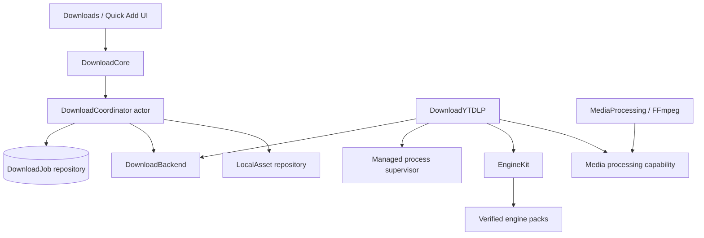

# Vidindir Download Engine

Status: foundation specification
V1 backend: yt-dlp
Media processor: FFmpeg
Target: persistent, replaceable, independently updateable engine

This document defines the boundary between Vidindir's library/application and media download implementations. yt-dlp is the first backend; it is not the product model and cannot leak into feature UI or persistence contracts.

Users must download only media they own, media offered under a compatible license, or media they otherwise have permission to download. Vidindir does not bypass DRM and does not promise that a provider permits file downloads merely because an extractor technically works.

## 1. Architectural rules

1. The library works without an installed or healthy download engine.
2. UI and Features depend on `DownloadCore`, never yt-dlp, FFmpeg, Deno, `Process`, or terminal output.
3. A `DownloadJob` is persisted before external work starts and survives app termination.
4. Backend output is untrusted. Only versioned structured events change durable state.
5. A job pins a backend and engine version for an attempt; an update never swaps binaries under a running job.
6. A final file becomes a `LocalAsset` only after post-processing and filesystem verification succeed.
7. Engine packs are immutable, signed, digest-verified, health-checked, and atomically activated.
8. App updates and engine updates are separate channels with separate versions and rollback.
9. User-provided text is never evaluated by a shell.
10. Backend capability, not a hard-coded YouTube-only UI, determines whether a URL can be resolved.

## 2. Component boundaries



### Ownership

| Layer | Owns |
| --- | --- |
| `DownloadCore` | backend-neutral requests/results/events, durable state machine, queue policy, coordinator actor, error categories |
| `DownloadYTDLP` | yt-dlp metadata/format mapping, argument construction, process execution adapter, structured event decoding |
| `MediaProcessing` | FFmpeg discovery capability and standalone merge/extract/convert/metadata operations |
| `EngineKit` | manifests, download/update, verification, installation, activation, health, rollback |
| `Persistence` | jobs, checkpoints, attempts, local assets, transactional completion |
| `SystemIntegration` | bookmarks, Finder/notifications, low-level process supervision if shared |
| Features | user intent and presentation only |

For the yt-dlp backend, yt-dlp may invoke the FFmpeg executable supplied by `MediaProcessing` to merge streams or extract audio. This does not make FFmpeg a UI dependency. Transformations outside a backend run through a backend-neutral `MediaProcessor` protocol.

## 3. Backend-neutral API

Representative public contracts:

```swift
public protocol DownloadBackend: Sendable {
    var descriptor: DownloadBackendDescriptor { get }

    func resolve(_ request: MediaResolveRequest) async throws -> ResolvedMedia
    func availableFormats(
        for media: ResolvedMedia,
        request: FormatQuery
    ) async throws -> [DownloadOption]
    func makeExecution(
        _ request: BackendDownloadRequest
    ) async throws -> PreparedDownloadExecution
}

public protocol DownloadExecution: Sendable {
    var jobID: DownloadJob.ID { get }

    /// Starts at most once. Cancellation of the consuming task must stop the
    /// managed process tree and finish the stream exactly once.
    func start() async throws -> AsyncThrowingStream<DownloadBackendEvent, Error>
    func requestPause() async throws
    func cancel() async
}

public struct PreparedDownloadExecution: Sendable {
    public let descriptor: DownloadExecutionDescriptor // backend + engine versions
    public let execution: any DownloadExecution
}
```

`PreparedDownloadExecution` contains the backend/engine version descriptor that Persistence records before `start`, plus the execution handle. The concrete adapter obtains an immutable EngineKit lease through an injected port and the handle retains that opaque lease until it terminates; no EngineKit type crosses the DownloadCore protocol. `DownloadExecution` is normally an actor or actor-backed handle.

Core event cases are stable and backend-neutral:

```text
preparing
metadata(ResolvedMedia)
artifactPlanned(relativeDisplayName)
progress(downloadedBytes, totalBytes?, speed?, eta?, phase)
postProcessing(step, fraction?)
artifactProduced(VerifiedArtifactCandidate)
diagnostic(SanitizedDiagnostic)
finished(BackendResult)
```

An event stream has one terminal outcome: return success, throw a categorized error, or finish because coordinator cancellation was confirmed. Unknown backend event kinds are diagnostic only and cannot advance state.

### Resolution model

`ResolvedMedia` includes stable source identity when available, title, creator, description, duration, thumbnail URL, media kind, playlist/collection information, and a backend resolution token. Tokens are local, short-lived, versioned, bounded, and never synchronized. Metadata resolution can fail while the source URL remains saved in the library.

A playlist/batch resolution returns a parent plan plus ordered child descriptors. Persistence creates child `MediaItem`/`DownloadJob` records idempotently after user confirmation. A parent DownloadJob aggregates child state; it does not own one giant backend process.

## 4. User-facing format model

The primary interface exposes intent, not extractor syntax:

```text
Kind:      Video | Audio
Quality:   Best | 1080p | 720p | 480p | Audio best
Container: Automatic, or a simple compatible choice such as MP4/MP3
```

`DownloadRequestSnapshot` stores:

- source URL and MediaItem ID;
- media kind;
- quality preset/cap;
- container preference;
- optional subtitle/thumbnail policy when those features ship;
- destination bookmark reference/path snapshot;
- playlist/batch policy;
- request schema version.

It does not store raw yt-dlp flags. `YTDLPBackend` maps intent to format selectors and validates that the planned post-processing can produce the requested container. “1080p” means best available height at or below 1080 unless the advanced UI explicitly requests an exact representation. The resolved actual codecs/container are shown in details when known.

Advanced settings live behind a separate UI and still map to typed, allow-listed options. Arbitrary command-line injection is never a supported customization path.

## 5. Durable state machine

Canonical states:

```text
created -> resolving -> ready -> queued -> downloading -> postProcessing -> completed
```

Side states:

```text
paused
failed
cancelled
interrupted
```

Allowed transitions:

| From | To |
| --- | --- |
| `created` | `resolving`, `cancelled` |
| `resolving` | `ready`, `failed`, `cancelled`, `interrupted` |
| `ready` | `queued`, `cancelled` |
| `queued` | `resolving` (expired plan), `downloading`, `paused`, `cancelled` |
| `downloading` | `postProcessing`, `completed`, `paused`, `failed`, `cancelled`, `interrupted` |
| `postProcessing` | `completed`, `failed`, `cancelled`, `interrupted` |
| `paused` | `queued`, `cancelled` |
| `failed` | `resolving`, `queued`, `cancelled` |
| `interrupted` | `resolving`, `queued`, `cancelled` |
| `completed` | none |
| `cancelled` | none; “try again” creates a new job or explicit cloned attempt |

The coordinator is the only production component allowed to transition states. Persistence rejects an invalid transition even if called incorrectly.

Transition semantics:

- `created`: request snapshot is durable; no network/process side effect has started.
- `resolving`: backend resolves identity/metadata/formats.
- `ready`: the execution plan and destination are valid.
- `queued`: eligible for concurrency scheduling.
- `downloading`: bytes/fragments are being acquired.
- `postProcessing`: merge, extraction, remux, conversion, or metadata embedding is running.
- `paused`: no managed process is running and resumable partial data is retained.
- `failed`: an attempt ended with category/retryability and sanitized detail.
- `interrupted`: app/process ended without a deliberate terminal result.
- `completed`: verified final artifact and available LocalAsset committed atomically.

The UI may show “Pausing…” as transient presentation state, but the durable job remains `downloading` until the process tree exits and partial data is safe. Post-processing is not pausable in V1; a pause request during that phase is rejected or becomes cancel/retry after an explicit UX decision.

On launch, a reconciliation transaction converts `resolving`, `downloading`, and `postProcessing` jobs with no live owned execution to `interrupted`. It verifies completed assets independently. `queued` and `paused` remain as stored.

## 6. DownloadCoordinator actor

One `DownloadCoordinator` actor owns queue scheduling for the current device:

- observes durable jobs and wakes for eligible work;
- limits concurrent resolutions and downloads separately;
- asks the selected backend to prepare an execution, then persists its pinned backend/engine descriptor before start;
- creates exactly one active execution per job/attempt;
- serializes state transitions and terminal handling;
- coalesces progress for UI and persistence;
- handles pause, cancel, retry, app shutdown, and network recovery;
- creates/updates `LocalAsset` through one completion transaction;
- publishes immutable snapshots/events to Features.

Default V1 policy is conservative: two concurrent downloads and four concurrent metadata resolutions, adjustable in Settings. Jobs are FIFO within user priority; later explicit reordering changes a stored rank. Playlist children participate like normal jobs, preventing one playlist from bypassing limits.

Progress can update UI at roughly 5 Hz, but database checkpoints are limited (for example, once per second) and always written at phase/terminal boundaries. Values are validated and monotonic where the backend provides a stable total; format switches may legitimately change totals, so byte counts are not used as state authority.

Every attempt increments `attemptCount` before process launch and records backend/engine version. A retry uses retained safe partial data when compatible. If engine/backend/request versions are incompatible with old resume data, the coordinator asks to restart or moves incompatible partial data aside; it never presents a restarted transfer as resumed.

## 7. yt-dlp adapter

yt-dlp supports many sites through extractors, so Vidindir is not architecturally YouTube-only. The backend attempts structured resolution for an HTTP(S) URL and returns one of:

```text
supported(resolution)
unsupportedSource
unavailable(reason)
authenticationRequired
drmProtected
temporaryFailure
```

Support changes with engine versions and source websites. The UI must say “supported by the installed engine” rather than maintain a misleading static platform promise. X/Twitter and other sources may work when the installed yt-dlp extractor supports the public media; login, private posts, DRM, geographic restrictions, platform terms, and site changes can still prevent access.

### Metadata and format resolution

Use yt-dlp's structured JSON modes (for example, single-item JSON/playlist JSON) with an explicit schema adapter. Do not scrape titles, durations, or formats from human-readable terminal lines. Decoder fixtures include missing fields, unknown fields, playlists, numeric strings, `null`/`NA`, large values, malformed UTF-8, and schema changes.

### Execution arguments

The adapter constructs an executable URL and argument array. Required safety flags/policies include:

- `--ignore-config` so user/global config cannot alter app guarantees;
- non-colored, newline-delimited output;
- a backend-owned output template with bounded names;
- explicit destination and verified FFmpeg location;
- an explicit playlist policy (`--no-playlist` for one item; never accidental expansion);
- the option terminator `--` immediately before each user source URL;
- no `--exec`, shell hook, arbitrary postprocessor argument, or ambient config escape;
- a minimal explicit environment and controlled current directory.

The adapter must not invoke `/bin/sh`, `zsh -c`, `env`, or a user-defined interpreter. A pasted URL remains one opaque argument.

### Structured event protocol

Execution uses yt-dlp `--progress-template` and stage-specific `--print` templates to emit tagged JSON lines. Protocol V1 lines are logically:

```text
__VIDINDIR_YTDLP__{"protocol":1,"event":"progress",...}
__VIDINDIR_YTDLP__{"protocol":1,"event":"plannedArtifact","path":"..."}
__VIDINDIR_YTDLP__{"protocol":1,"event":"postProcessing","step":"merge"}
__VIDINDIR_YTDLP__{"protocol":1,"event":"artifact","path":"..."}
```

Events carry only typed values: status, byte counts, totals/estimate, speed, ETA, stage, and artifact path. Numeric decoding is lossy-safe and rejects non-finite/out-of-range values. Unknown protocol/event values become diagnostics. A malformed tagged event cannot be reinterpreted as a successful human log line.

Untagged stdout/stderr is a bounded diagnostic stream. A small set of backend-owned classifiers may improve error categorization, but log regexes do not drive successful completion or locate the final file. The authoritative artifact comes from the structured after-move event and is verified on disk.

### Artifact validation

Before recording an artifact:

1. Resolve relative paths against the authorized destination.
2. Standardize and resolve symlinks for both destination and artifact.
3. Verify the artifact remains a descendant of the authorized destination and is not the destination directory itself.
4. Open/stat it without following a newly swapped unsafe link where the platform API permits.
5. Verify it is a regular file, has a plausible non-negative size, and matches the planned output kind/container where detectable.
6. Create/refresh a security-scoped bookmark.
7. Commit `LocalAsset.available` and `DownloadJob.completed` in one database transaction.

Failure after bytes exist but before this commit leaves an `interrupted` or `failed` job and an unclaimed candidate for safe recovery; it never creates a phantom completed item.

## 8. Pause, resume, cancel, and process supervision

yt-dlp resume behavior usually relies on its partial files/fragments and continuation support. V1 pause semantics are process-level checkpointing:

1. mark an in-memory pause request;
2. ask the managed process tree to terminate gracefully;
3. wait for pipes and exit within a bounded timeout;
4. preserve only backend-recognized partial artifacts;
5. transition to `paused` after quiescence;
6. on resume, create a new attempt with compatible engine/request and continuation enabled.

Some sources/streams cannot resume and will restart. The backend reports resume capability when known; the UI communicates “will restart” rather than claiming byte-perfect continuation. Using `SIGSTOP` as durable pause is forbidden because it cannot survive app exit and can strand child processes.

Cancel terminates the entire owned process group, not only the yt-dlp parent. After a grace period it escalates termination. Partial-file deletion follows an explicit user/default policy and is constrained to backend-owned paths inside the destination. Never recursively delete a user-selected directory.

The production process supervisor must create/track a process group or equivalent ownership boundary so FFmpeg/Deno children cannot be orphaned. It drains stdout and stderr concurrently with byte-safe line framing, enforces per-line/total diagnostic bounds, closes handles, and resolves its continuation exactly once under cancellation races.

## 9. Media processing

`MediaProcessor` provides typed operations such as:

```text
merge(video, audio, container)
extractAudio(input, codec/container, quality)
remux(input, container)
embedMetadata(input, fields)
embedThumbnail(input, image)
```

It validates compatibility before work, reports structured progress where available, writes to a unique temporary sibling, verifies the result, and atomically moves it to the final name. It never overwrites an unrelated existing file; conflict naming is deterministic and user-configurable.

FFmpeg command construction follows the same no-shell, absolute-path, process-group, bounded-output, and artifact-containment rules as yt-dlp. The selected FFmpeg build and its license configuration are part of the engine manifest and diagnostic version screen.

## 10. Engine pack format

App version and engine version are independent:

```text
Vidindir app:      1.2.0
Download engine:  2026.07.1
yt-dlp:            2026.xx.xx
FFmpeg:            x.y.z
Deno/JS runtime:   x.y.z (only when required)
```

An engine pack contains a signed manifest plus only the components approved for that distribution:

```text
EnginePack/
  manifest.json
  manifest.sig
  bin/
    yt-dlp
    ffmpeg
    ffprobe
    deno             # optional/declared
  licenses/
    THIRD_PARTY_NOTICES.md
    ... exact license/source-offer material ...
  sbom/
    components.spdx.json
```

Manifest fields:

```text
manifestVersion
engineID
engineVersion
releaseChannel
createdAt
minimumAppVersion
maximumAppVersion?
platform = macOS
architectures
capabilities
components[]:
  role
  relativePath
  version
  architecture
  byteSize
  sha256
  executable
  licenseIdentifier
  upstreamSourceURL
healthChecks[]
signingKeyID
```

Canonical manifest bytes are signed by an offline release key. TLS protects transport, but TLS and a hash fetched from the same server are not sufficient authenticity. The app embeds trusted public keys and a key-rotation/revocation policy. Exact signature scheme and canonicalization require ADR-003.

## 11. Verify, install, health-check, activate, rollback

Engine update pipeline:

```text
discover -> download -> verify manifest -> unpack safely -> verify components
         -> platform/signature checks -> health check -> atomic install -> activate
```

Required behavior:

1. Download to a unique `Engines/staging` directory with size/time limits.
2. Verify manifest signature and app/platform/version compatibility before trusting component paths.
3. Extract with traversal protection: reject absolute paths, `..`, unexpected symlinks/hardlinks, devices, sockets, and undeclared files.
4. Verify every declared byte size and SHA-256; reject missing or extra executable components.
5. Verify architecture and the release's macOS code-signing/notarization/designated-requirement policy.
6. Apply fixed least-privilege permissions; no world-writable executables.
7. Run bounded, offline health checks such as version output and a packaged local fixture probe. A source-site network request is not a reliable activation health check.
8. Rename the verified staging directory to immutable `Engines/<version>`.
9. Atomically change the activation record while retaining the previous known-good pack.
10. Acquire leases from the active pack for new attempts; existing attempts keep their old lease.

If verification or health fails, never activate the candidate. If an engine-level regression is detected immediately after activation, EngineKit can deactivate it and restore the prior healthy version; ordinary “video unavailable” failures must not trigger rollback. Automatic rollback thresholds and release revocation require an ADR and telemetry-free local criteria.

Cleanup retains at least active and previous healthy versions, any version leased/referenced by a running or resumable job, and a short diagnostic retention set. Cleanup never deletes a leased version and never runs by recursively removing an unchecked manifest path.

If no managed engine is installed, the UI still opens the library. A development or explicitly chosen Homebrew fallback may be offered, but production must label it as externally managed and cannot silently prefer `PATH` over a verified pack.

## 12. Engine and app updates

The app updater distributes signed/notarized Vidindir application releases. EngineKit distributes engine packs. They have distinct channels, manifests, cadence, and rollback state.

- An app update can declare a minimum engine protocol/version.
- An engine pack declares its compatible app range.
- Engine discovery may be automatic; download/activation follows the user's update setting and platform policy.
- A security revocation can mark a pack unusable only through a signed revocation document and must leave clear recovery guidance.
- Offline users can continue with a non-revoked installed engine; expiration policies require an ADR and should be avoided unless security demands them.
- Settings exposes app version, engine version, component versions, update channel, last check, health, rollback, reset, and sanitized logs.

## 13. Security model

Third-party extraction code processes hostile remote data and changes frequently. Required controls include:

- verified immutable executables and a minimal inherited environment;
- no shell, aliases, ambient config, arbitrary plugins, or executable postprocessing hooks;
- URL arguments after `--` and typed option construction;
- explicit network destinations for engine updates; source downloads necessarily contact the pasted site's hosts/CDNs;
- bounded process lifetime for resolution/health operations and user-controlled lifetime for downloads;
- bounded stdout/stderr and strict JSON decoding;
- destination permission through security-scoped bookmarks;
- path/symlink containment and race-aware final verification;
- process-tree termination and no orphan helpers;
- redaction of URLs/query strings, cookies, auth headers, command lines, and filenames in routine logs;
- no automatic import of browser cookies. Any future authenticated-source support is opt-in, Keychain-backed, least-privilege, and requires a security/privacy ADR;
- no remotely downloaded executable JavaScript or plugin component unless it is pinned/verified by an approved signed engine policy.

The current yt-dlp ecosystem may require a JavaScript runtime and challenge components for some sites. Whether Vidindir bundles those components or permits yt-dlp remote components is a release-blocking ADR. Production must not silently download and execute `ejs:npm` or similar remote code based only on extractor output.

## 14. Licensing and supply chain

Engine distribution is both a technical and legal release surface. Before Vidindir redistributes binaries, release engineering must inventory the exact artifacts—not just upstream project headlines.

- yt-dlp is primarily Unlicense, but standalone builds and optional components may contain additional licenses.
- FFmpeg can be LGPL or GPL depending on compile-time options and linked libraries. The exact build determines obligations.
- Deno is MIT, while fetched JavaScript/npm components have their own licenses.
- A standalone executable may bundle Python/runtime libraries with separate notices.

Every pack must include an SBOM, component versions/digests, exact license texts/notices, upstream source locations, and any required corresponding-source or written-offer material. Release CI rejects a component absent from the reviewed allow-list. `THIRD_PARTY_NOTICES.md` and the in-app acknowledgements must describe the exact shipped configuration.

Code signing, notarization, license compliance, SBOM generation, reproducibility/provenance, and update-key custody are release gates. This document is not legal advice; redistribution requires qualified review. Until that review and ADR-003 are complete, the existing separately installed Homebrew model remains the safe development fallback, not the final one-drag installation experience.

## 15. Error taxonomy and user mapping

Backends return stable categories:

```text
unsupportedSource
invalidURL
mediaUnavailable
privateMedia
authenticationRequired
permissionOrTermsRestriction
drmProtected
geographicRestriction
rateLimited(retryAfter?)
networkUnavailable
destinationPermissionLost
insufficientDiskSpace
formatUnavailable
engineMissing
engineIncompatible
engineCorrupt
processLaunchFailed
backendProtocolError
postProcessingFailed
artifactValidationFailed
cancelled
interrupted
unknown(retryability)
```

User UI shows a concise explanation and actions (`Retry`, `Choose Folder`, `Update Engine`, `View Source`, `Technical Details`). Raw stderr is never the title/message. Technical detail is sanitized, bounded, and optional. Retryability comes from the category plus context, not string matching alone.

Before starting and during large transfers, the coordinator checks available capacity when practical. Disk-full or permission failure preserves the library and recoverable partial state; it does not mark completion.

## 16. Current implementation and migration

The current prototype already has valuable seams:

- `DownloadBackend` and backend-neutral app events prevent `AppModel` from consuming yt-dlp event types directly.
- `DownloadEngineManaging` separates engine readiness/preparation from downloads; `HomebrewDownloadEngineManager` is the current Developer Preview implementation.
- `AppModel` is injected with those two application-owned contracts, while `DurableDownloadRecorder` bridges the current one-active-download execution path into persistent jobs and local assets.
- `YTDLPCommandBuilder` uses absolute tool URLs, `--ignore-config`, typed arguments, and `--` before the source URL.
- `YTDLPEventDecoder` consumes a sentinel plus JSON and tolerates lossy numeric fields.
- `ByteLineFramer`, `SubprocessRunner`, and `YTDLPDownloadService` concurrently drain process output.
- `ArtifactResolver` rejects reported artifacts outside the selected destination.
- `DownloadPreferencesStore` remembers separate MP4/MP3 security-scoped folders and quality presets.
- `BinaryLocator` finds bundled, Homebrew, system, and `PATH` tools.
- `ToolInstallService` can explicitly ask Homebrew to install yt-dlp, FFmpeg, and Deno.
- `MediaMetadataResolver` consumes bounded structured yt-dlp JSON independently from execution.
- GRDB persists validated `DownloadJob` transitions and device-aware `LocalAsset` evidence. Relaunch converts genuinely in-flight work to `interrupted`; legacy `UserDefaults` history has an idempotent evidence-preserving importer.
- The underlying `YTDLPDownloadService` still allows only one in-memory active execution; persistent scheduling, pause/resume, and retry execution are the next coordinator boundary.

Migration sequence:

1. Move the current `DownloadBackend` request/event/error seam into `DownloadCore` while adapter tests keep current behavior.
2. Move the already existing `YTDLPBackend`, command builder, decoder, artifact adapter, and process execution into their own target; add protocol version to structured events while accepting the legacy sentinel schema during one migration window.
3. Replace lock-based single execution with an actor-backed execution/process supervisor. Add process-group cancellation, output limits, symlink-aware containment, and exactly-once completion tests.
4. Replace the durable single-execution bridge with `DownloadCoordinator`; add execution leasing, queue concurrency, pause/resume, retry, and persisted backoff without weakening the existing state-machine rules.
5. Add playlist/batch expansion and restart-safe automatic reconciliation on top of the coordinator. Metadata resolution is already separate from execution.
6. Introduce `MediaProcessing` capability ownership while allowing yt-dlp to call the supplied FFmpeg path.
7. Introduce EngineKit in shadow mode: discover/verify/report a candidate without activating it. Complete signed-pack, sandbox, notarization, and licensing decisions before self-managed activation.
8. Retain explicit Homebrew fallback for development and migration. Remove mandatory Homebrew only after managed packs work on clean macOS 15 Intel/Apple Silicon accounts in signed/notarized builds.

The current command uses `--remote-components ejs:npm`; production migration must disable it unless the signed remote-component policy ADR explicitly approves and verifies that path.

## 17. Acceptance tests

Offline deterministic tests must prove:

1. Features and coordinator operate with a fake backend and do not import yt-dlp/FFmpeg modules.
2. Every state transition is accepted/rejected exactly as specified and persists atomically.
3. Relaunch converts orphaned active phases to `interrupted` and safely requeues on request.
4. Two coordinators cannot execute the same job attempt concurrently.
5. Queue concurrency, fairness, playlist children, cancellation, and persisted backoff remain correct under task races.
6. Progress flooding is coalesced and invalid/non-finite metrics never reach SQLite/UI.
7. A URL beginning with option-like text remains one argument after `--`; no test input reaches a shell.
8. Global yt-dlp config, `PATH`, and environment variables cannot alter a managed production invocation.
9. Structured decoder handles partial UTF-8, malformed/unknown/versioned events, huge lines, stdout/stderr interleaving, and final-line-without-newline.
10. Human log text cannot forge completion or an output path.
11. Absolute, relative, `..`, prefix-confusion, Unicode, and symlink-swap artifact attacks cannot escape the authorized destination.
12. Cancel/pause terminates the whole fixture process tree and resolves exactly once under concurrent exit/cancel.
13. Completion creates a verified `LocalAsset` and completed job in one transaction; injected failure creates neither phantom state.
14. Resume retains only recognized partials and visibly restarts when source/engine is incompatible.
15. Engine verification rejects bad signature, unknown key, digest/size mismatch, traversal, symlink, extra executable, wrong architecture, incompatible app version, bad permissions, and failed health checks.
16. Activation is atomic under injected crashes at every stage and rollback keeps a known-good pack.
17. Cleanup cannot delete active, previous, or leased packs.
18. Release CI produces an SBOM/notices set matching every engine component.

Opt-in network integration tests use content the project owns or has explicit permission to download. They test at least one small video, one audio extraction, a playlist fixture where legally permitted, one non-YouTube supported source, network interruption, and a deliberately unsupported URL. Mutable source-site tests never gate ordinary unit PRs by themselves.

Signed release acceptance additionally covers clean macOS 15 installations on Apple Silicon and Intel (or an explicitly documented architecture policy), App Sandbox/hardened runtime behavior, user-selected folders, Gatekeeper/notarization, engine update/rollback, app update compatibility, and a machine without Homebrew.

## 18. Decisions requiring ADRs

- Managed engine-pack redistribution, exact component builds/licenses, signing algorithm, key rotation/revocation, and provenance.
- App Sandbox/hardened-runtime/process-group implementation for downloaded executables.
- JavaScript runtime/challenge components: bundled and pinned versus tightly controlled remote retrieval.
- Pause/resume claim and partial-file cleanup defaults for sources that cannot resume.
- Engine rollback threshold without analytics and response to a signed security revocation.
- Cookie/authenticated-source support and credential isolation, if ever added.
- Intel support and universal versus per-architecture packs.
- FFmpeg build configuration and LGPL/GPL compliance strategy.
- Output conflict naming/overwrite policy and race-resistant filesystem APIs.
- Whether production permits any external Homebrew/custom-engine override and how it is visibly isolated from managed support.
