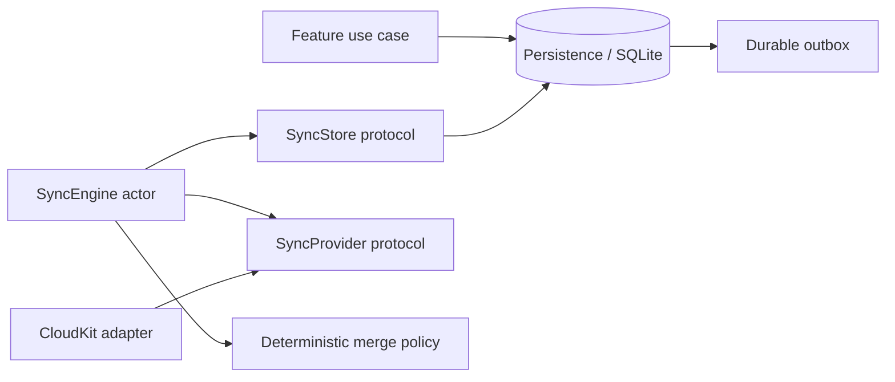

# Vidindir Sync Protocol

Status: foundation specification
V1 provider: CloudKit private database
V1 scope: Personal Workspace metadata only

Vidindir synchronization replicates a selected set of local SQLite records. It is not remote storage for the database and it is not media-file transfer. The app remains usable when sync is disabled, signed out, throttled, or offline.

## 1. Protocol invariants

1. SQLite remains the local source of truth; every remote change is validated and committed through Persistence.
2. `SyncCore` is provider-neutral. It imports neither CloudKit nor a future provider SDK.
3. Remote identity is stable: one logical entity maps to one provider record identity.
4. Push and pull are idempotent. Replaying a page, mutation, or acknowledgement does not duplicate user data.
5. Remote pages and cursors are staged atomically before merge. A crash cannot advance a cursor past unrecorded changes.
6. Local entity mutations and outbox creation are atomic.
7. Conflicts resolve deterministically on every device without a central Vidindir server.
8. Tombstones replicate as records. V1 does not physically delete them.
9. The protocol has an explicit entity allow-list. A new local table is not syncable by default.
10. Provider failure never blocks local library access or local downloads.

## 2. What synchronizes

V1 synchronizes these records for the Personal Workspace:

- `Workspace`
- `MediaItem`
- `Collection`
- `CollectionMembership`
- `Favorite`
- allow-listed `WorkspaceSetting`
- `Tag` and `MediaItemTag` when the feature/schema is enabled

V1 never synchronizes:

- downloaded video/audio bytes;
- `LocalAsset`, local file path, bookmark data, size verification, or device-local status;
- `DownloadJob`, progress, queue order, resume data, or process logs;
- engine paths, engine binaries, or engine activation state;
- provider credentials, CloudKit tokens, account identifiers, or security-scoped bookmarks;
- thumbnail cache or temporary files;
- clipboard contents, app logs, or analytics.

Comments, reactions, activity, and shared-workspace membership require a V2 protocol version and provider/trust ADR. They are not implied by V1 envelopes.

## 3. Components and dependency direction



`SyncCore` owns:

- remote envelope and mutation value types;
- provider/storage protocols;
- sync orchestration state machine;
- batch/coalescing rules;
- deterministic merge policy;
- retry classification and backoff policy;
- sync status suitable for presentation.

`Persistence` implements durable inbox/outbox, materialization, transactional merge, and cursor storage. `SyncCloudKit` implements zones, records, subscriptions, account state, conditional saves, and CloudKit error mapping. `MainApp` injects both into one `SyncEngine` actor per enabled endpoint.

Provider types (`CKRecord`, `CKRecordZone.ID`, `CKServerChangeToken`, provider errors) cannot appear in SyncCore, Domain, Persistence public APIs, or Features.

## 4. Provider-neutral contracts

Representative contracts are shown below. Exact names may evolve without weakening their semantics.

```swift
public protocol SyncProvider: Sendable {
    var kind: SyncProviderKind { get }

    func prepare(_ scope: SyncScope) async throws -> ProviderPreparation
    func push(
        _ mutations: [RemoteMutation],
        in context: ProviderContext
    ) async throws -> PushResult
    func pull(
        after cursor: ProviderCursor?,
        limit: Int,
        in context: ProviderContext
    ) async throws -> RemotePage
    func fetchRecords(
        _ identities: [RemoteIdentity],
        in context: ProviderContext
    ) async throws -> [RemoteRecord]
}

public protocol SyncStore: Sendable {
    func seedOutbox(endpoint: SyncEndpoint.ID) async throws
    func pendingChanges(endpoint: SyncEndpoint.ID, limit: Int) async throws -> [PendingChange]
    func materialize(_ changes: [PendingChange]) async throws -> [SyncEnvelope]
    func stageRemotePage(
        endpoint: SyncEndpoint.ID,
        page: RemotePage
    ) async throws
    func applyStagedChanges(
        endpoint: SyncEndpoint.ID,
        policy: MergePolicy,
        limit: Int
    ) async throws -> ApplyResult
    func acknowledge(
        endpoint: SyncEndpoint.ID,
        result: PushResult
    ) async throws
    func cursor(endpoint: SyncEndpoint.ID, scope: String) async throws -> ProviderCursor?
}
```

Opaque provider context, cursor, and record metadata are byte values with size limits. Only the provider adapter interprets them. `SyncEngine` never switches on provider-specific error types; the adapter returns stable categories.

## 5. Envelope format

Every syncable record is converted to a `SyncEnvelope`:

```text
protocolVersion       UInt16      currently 1
schemaVersion         UInt16      per entity payload
entityType            stable enum string
entityID              UUID
workspaceID           UUID
revision              Int64
createdAt              UTC epoch milliseconds
modifiedAt             UTC epoch milliseconds
modifiedByDevice      UUID
deletedAt              nullable UTC epoch milliseconds
payload                typed entity payload
payloadDigest          SHA-256 of canonical envelope fields
```

The canonical digest uses a documented canonical JSON encoder for scalar values and sorted object keys. It covers every semantic envelope field except `payloadDigest` itself and excludes provider metadata, retry counts, and cursor data. Digests detect corruption and deterministically break the extremely rare case where two different payloads have the same version stamp; they are not authentication. Provider authenticity comes from its transport/account model and, where applicable, signed update infrastructure.

Payload rules:

- A V1 tombstone includes the last accepted entity payload as well as identity, workspace, version metadata, and `deletedAt`. This lets a new device materialize a soft-deleted row under SQLite's required-field and foreign-key constraints. The payload is hidden from normal queries but remains retained until a future safe compaction protocol exists.
- Unknown entity types or a newer `protocolVersion` are staged but not applied or echoed. Sync reports `upgradeRequired` rather than dropping them.
- A known entity with a newer payload schema is preserved in the durable inbox until a compatible app version handles it.
- Strings and collections have per-field and per-record size limits. Invalid numbers, URLs, IDs, workspace relationships, and timestamps are rejected before merge.
- Credentials, bookmark blobs, local paths, and arbitrary backend options are forbidden by the encoder and decoder allow-lists.

Suggested V1 limits are 8 KiB per URL, 1,000 characters per title, 500 per creator, 20,000 per description, 100 per collection/tag name, and 256 KiB for an entire logical record. Final limits require CloudKit quota testing and an ADR.

## 6. Local mutation and outbox

When a repository accepts a local syncable mutation, one SQLite transaction:

1. validates workspace and expected revision;
2. updates or tombstones the entity with a new version stamp;
3. updates derived search state;
4. appends one `change_journal` entry;
5. inserts a `sync_outbox` row for every explicitly enabled endpoint except the mutation's remote origin.

An outbox row references a journal entry rather than copying the payload. Before push, Persistence materializes the current entity version. `SyncEngine` may coalesce multiple pending changes for the same endpoint/entity and send only the latest version. Superseded rows are acknowledged locally only after the latest version is durably selected; no unsent tombstone may be hidden by an older upsert.

`change_id` is the idempotency key for delivery accounting. Logical remote identity is `(entityType, entityID)`, so replaying a change writes the same provider record.

When an endpoint is first enabled, `seedOutbox` transactionally enumerates every current syncable row—including tombstones—and creates endpoint delivery work for its latest version without incrementing entity revisions. This is required because records may predate the endpoint or come from a legacy import. Re-running the seed is idempotent.

## 7. Durable pull inbox

Provider pages may be duplicated, reordered across entity types, or interrupted by app termination. For each page, Persistence atomically:

- stores each validated raw `SyncEnvelope` in `sync_inbox` under a stable delivery/version digest;
- stores opaque per-record provider metadata needed for conditional writes;
- advances the opaque cursor for that provider scope.

Only after this transaction does `SyncEngine` ask Persistence to merge staged records. If the app crashes, it resumes the inbox without refetching; if it refetches anyway, the delivery digest makes staging idempotent.

Merge order within a batch is:

1. Workspace;
2. MediaItem, Collection, Tag, WorkspaceSetting;
3. CollectionMembership, MediaItemTag, Favorite.

If a relationship references a missing parent, SyncEngine point-fetches the stable parent identities through the provider and stages them. If they do not exist remotely, the relationship remains deferred with a bounded diagnostic; it is not inserted by disabling foreign keys. A tombstoned parent makes the relationship ineffective but does not require deleting the relationship record.

Inbox records are marked `applied`, `superseded`, `deferred`, `upgradeRequired`, or `invalid`. Cursor progress is independent from apply progress because the raw compatible record is already durable. Invalid/quarantined records remain visible to diagnostics and do not poison unrelated records.

## 8. Sync cycle

`SyncEngine` is an actor with states:

```text
disabled
idle
preparing
syncing(push | pull | apply)
waitingForNetwork
backingOff(until)
blocked(reason)
```

One cycle performs:

1. Check endpoint enablement, network policy, provider account state, and cancellation.
2. Prepare/create provider scope idempotently.
3. Drain and apply any already-staged inbox records.
4. Coalesce and push a bounded outbox batch.
5. Persist acknowledgements and provider record metadata.
6. Pull pages from the last durable cursor, staging every page transactionally.
7. Apply staged records in dependency order after each page.
8. Repeat while the provider says more changes exist, within a time/work budget.
9. Publish success state and schedule the next trigger.

Push-before-pull reduces latency for local changes but does not assume the local version wins. A conditional-write conflict returns the server record, which is staged and merged. If local still wins under the deterministic comparator, a subsequent conditional push writes it against the newly observed server version. If remote wins, obsolete local outbox entries are acknowledged as superseded.

Triggers include app launch, foreground activation, local outbox insertion, provider subscription notification, network recovery, explicit refresh, and bounded periodic maintenance. Triggers coalesce; they do not run concurrent cycles for one endpoint.

Cancellation leaves staged inbox, outbox, cursor, and acknowledgements in a valid restartable state.

## 9. Deterministic conflict resolution

V1 uses entity-record last-write-wins (LWW), not CRDTs and not field-level merge. All scalar payload fields in one entity row form one register. Relationships are separate entity records, so adding a collection membership does not conflict with editing a media title.

For two valid versions with the same `(entityType, entityID)`, compare this key lexicographically:

```text
(
  modifiedAt milliseconds,
  revision,
  deletionBit,             # 1 for tombstone, 0 for live
  modifiedByDevice UUID,
  payloadDigest
)
```

The greater key wins. UUID and digest comparison use unsigned byte order, not localized string order. `deletionBit` means an exactly concurrent/equivalent delete wins over a live value; a genuinely later live write can intentionally restore a tombstone. If digests match, the versions are equivalent and no revision is manufactured.

Rules by kind:

- **Workspace, MediaItem, Collection, Tag, WorkspaceSetting:** entire record LWW.
- **CollectionMembership, MediaItemTag, Favorite:** independent relationship-record LWW. Deterministic relationship IDs ensure devices address the same logical relationship.
- **Deletion:** a tombstone is compared by the same key and retained after winning.
- **Missing local record:** accept the remote record after schema/workspace validation.
- **Dirty local record loses:** apply remote and mark pending older local delivery as superseded.
- **Dirty local record wins:** retain it and ensure the latest version remains pending for conditional push.
- **Malformed record:** never participates in comparison.

Wall-clock skew can cause a later real-world action to lose to a device whose clock is far ahead. For a local mutation, V1 authors `modifiedAt = max(wallClockNow, previousRecord.modifiedAt + 1 ms, deviceLastAuthoredAt + 1 ms)` so a causally later edit wins its base version. It detects an implausibly future result, reports clock guidance, and does not silently rewrite an already accepted remote stamp. A hybrid logical clock is preferred if ADR-005 can be completed before sync schema freeze.

Provider server timestamps are diagnostic and retry inputs, not the semantic conflict key. This keeps behavior consistent across CloudKit and future providers.

## 10. Personal Workspace identity

Domain declares `Workspace.ID.personalV1` as `4ce29601-0ff5-55fb-995f-2329e01734d8` using the frozen UUIDv5 scheme in `DATA_MODEL.md`. Every installation uses this ID for its default Personal Workspace. This is safe because provider accounts and local databases are separate namespaces, and it prevents two offline Macs from creating incompatible personal-workspace roots before first sync.

Shared workspaces use random UUIDs. Changing the personal-workspace identity strategy requires an ADR, a database rewrite, relationship-ID regeneration, and provider migration; it is not a cosmetic change.

## 11. CloudKit V1 mapping

The CloudKit adapter uses the user's private iCloud database and one custom record zone for personal data:

```text
zone name: VidindirPersonal-v1
owner:     current user
database:  private
```

The container identifier, development/production environments, entitlement ownership, and schema-deployment procedure must be recorded in ADR-004 before implementation lands.

Stable mapping:

| Logical type | CloudKit record type | Record name |
| --- | --- | --- |
| Workspace | `VDWorkspaceV1` | `workspace-<uuid>` |
| MediaItem | `VDMediaItemV1` | `media-<uuid>` |
| Collection | `VDCollectionV1` | `collection-<uuid>` |
| CollectionMembership | `VDCollectionMembershipV1` | `membership-<uuid>` |
| Tag | `VDTagV1` | `tag-<uuid>` |
| MediaItemTag | `VDMediaItemTagV1` | `media-tag-<uuid>` |
| Favorite | `VDFavoriteV1` | `favorite-<uuid>` |
| WorkspaceSetting | `VDWorkspaceSettingV1` | `setting-<uuid>` |

Common CloudKit fields mirror the envelope (`protocolVersion`, `schemaVersion`, `entityID`, `workspaceID`, `revision`, `createdAtMs`, `modifiedAtMs`, `modifiedByDevice`, `deletedAtMs`, `payloadDigest`). Entity payloads use explicit typed fields; there is no `library.json` or database blob. Relationship endpoints are UUID strings, not delete-cascading `CKReference` values, because tombstone and out-of-order semantics belong to SyncCore.

Downloaded media and thumbnails are not stored as `CKAsset`. A thumbnail URL is ordinary MediaItem metadata and is subject to normal URL limits.

CloudKit record system fields/change tags are archived as opaque provider metadata per endpoint/entity. Saves use “if server record unchanged” semantics. On `serverRecordChanged`, the adapter returns the server envelope and current metadata to SyncCore rather than choosing a winner. Batch partial failures are returned per mutation; successful records are acknowledged even when retryable siblings fail.

The adapter uses zone-change tokens for incremental pull and stores them only through the durable page transaction. A token-expired/change-token-expired response clears that zone cursor after recording the condition, performs a full zone enumeration into the idempotent inbox, and merges it. It must not clear the local library.

A silent push notification is only a hint to run a pull. Correctness never depends on receiving notifications.

Vidindir itself never uses native CloudKit record deletion in V1; it saves a tombstone record. If an expected record is externally/native-deleted, the adapter reports a provider deletion event. When the local row still exists, SyncCore creates a full tombstone with a local recovery stamp and pushes the tombstone record back so other devices converge. If no local payload exists, the adapter records a repair-required diagnostic rather than inventing an invalid entity. Manual CloudKit Dashboard deletion is unsupported and cannot carry the offline-convergence guarantees of an in-protocol tombstone.

## 12. Initial sync and account changes

### First enable

1. Confirm iCloud availability and explain which metadata will synchronize.
2. Create/find the custom zone and subscription idempotently.
3. Seed the endpoint outbox from the complete local syncable snapshot without changing entity versions.
4. Pull the complete zone into the durable inbox.
5. Merge it with the local Personal Workspace using normal conflict rules.
6. Push remaining local winners; remote winners supersede their seeded local deliveries.
7. Record endpoint readiness only after pull/apply/push reach a consistent checkpoint.

Because Personal Workspace identity is well-known, no workspace re-keying is required. Two offline devices may have created entities with different UUIDs for the same URL; duplicate detection can surface them, but sync must not silently merge distinct `MediaItem` identities.

### Sign-out or account unavailable

Local data remains visible and editable. The endpoint becomes `blocked(accountUnavailable)` and outbox rows accumulate. Provider tokens and account-scoped metadata are retained unless the user disconnects or the OS reports a confirmed account change.

### Account change

Never push one account's pending metadata into another account automatically. On confirmed account identity change, disable the old endpoint, isolate its provider metadata/tokens, and require the user to choose whether to connect the local Personal Workspace to the new account. The exact UX and whether local data should merge into the new account require an ADR before shipping account switching.

### Disable sync

Disabling stops network work but does not delete local library data. “Disconnect and remove cloud copy” is a separate destructive operation and is out of scope for V1 unless explicitly designed with confirmation and recovery.

## 13. Error taxonomy, retry, and recovery

Provider adapters map failures to:

```text
offline
networkUnavailable
rateLimited(retryAfter)
serviceUnavailable(retryAfter?)
notAuthenticated
accountChanged
permissionDenied
quotaExceeded
cursorExpired
serverConflict(remoteRecord)
payloadTooLarge
invalidRemoteRecord
upgradeRequired
providerConfiguration
unknown(retryability)
```

Retry behavior:

- Offline/network failures wait for reachability plus exponential backoff with jitter.
- Rate limiting honors provider retry-after and never spins.
- Service failures use capped exponential backoff.
- Authentication, account change, permission, quota, configuration, and upgrade errors block automatic retry until state changes or the user acts.
- A single invalid record is quarantined; unrelated batch records continue.
- A conflict is protocol flow, not a user-visible failure.
- After repeated retryable failures, the library remains usable and Settings shows concise status plus sanitized diagnostics.

Backoff timestamps are persisted so relaunch does not create a request storm. Manual refresh may request one immediate attempt but cannot bypass a provider-mandated retry-after.

## 14. Privacy and security

- CloudKit receives saved source/canonical URLs, titles, creators, descriptions, thumbnail URLs, organization records, and allow-listed settings. The user must be told this before enabling sync.
- Vidindir operates no relay server for V1 sync.
- CloudKit transport/account protection is used as provided by Apple. Vidindir does not claim application-level end-to-end encryption beyond CloudKit's documented guarantees.
- URLs may contain sensitive query values. Remote storage is necessary to sync the saved link, but logs, notifications, and error telemetry redact query/fragment data.
- Provider metadata and tokens stay in the app container; credentials use system account facilities/Keychain where required.
- Remote strings are untrusted: validate sizes/types, render as text, and never execute URLs or payload values automatically.
- A future provider must pass the same no-local-data and allow-list contract tests before activation.

## 15. Observability

Sync status exposed to UI is high level:

```text
Off
Up to Date
Syncing
Waiting for Network
Sign in to iCloud
Storage Full
Update Required
Needs Attention
```

Technical logs include endpoint-local opaque IDs, entity type, hashed entity ID where useful, counts, batch latency, cursor reset, retry category, and result. They exclude record payloads and source URLs. A user-initiated diagnostic export has an explicit schema and redaction tests.

## 16. Current implementation and migration

The current build has the provider-neutral local foundation: SQLite/GRDB records, a Personal Workspace, deterministic identifiers, revision metadata, tombstones, an atomic local change journal, endpoint outbox seeding, a durable remote inbox boundary, and an idempotent legacy-history import. It does not yet have `SyncCore`, a CloudKit provider, account/status UI, or enabled network synchronization.

Implementation order:

1. Keep sync disabled while the landed Domain/Persistence contracts remain covered by migration, transaction, allow-list, tombstone, and outbox tests.
2. Build `SyncCore` against deterministic in-memory `SyncProvider` and fault-injecting `SyncStore` tests.
3. Complete cursor/checkpoint semantics and crash-replay tests around the existing durable inbox.
4. Implement CloudKit mapping behind the provider protocol.
5. Add entitlements, development-container schema deployment, signed-in manual tests, account-change tests, and production promotion procedure.
6. Gate sync behind a feature flag until initial-sync, token-expiry, malformed-record, offline, clock-skew, and destructive-path acceptance tests pass.

Do not add CloudKit calls to the existing `AppModel` or SwiftUI views as an intermediate shortcut. The first provider code must enter through `SyncProvider`.

## 17. Acceptance tests

Provider-neutral deterministic tests must prove:

1. Local mutation and outbox insertion are atomic.
2. A page and cursor are staged atomically; a crash before or after commit replays without data loss.
3. Repeated push, pull, page, notification, and acknowledgement events are idempotent.
4. All permutations of two conflicting envelopes select the same winner on every device.
5. Relationship add/remove conflicts do not overwrite unrelated MediaItem fields.
6. Tombstones survive initial sync and prevent stale offline versions from winning unless those versions have a genuinely greater conflict key.
7. A local loser clears obsolete outbox work; a local winner conditionally retries against observed provider metadata.
8. Parent records apply before relationships; missing parents are fetched/deferred without disabling foreign keys.
9. Unknown protocol/schema versions are retained and reported as upgrade-required, not discarded.
10. Malformed and oversized records are quarantined while valid siblings apply.
11. No encoder can produce an envelope for `LocalAsset`, `DownloadJob`, bookmark, cursor, engine path, or cached data.
12. Token expiry performs full enumeration without deleting local-only or newer local records.
13. Retry-after and persisted backoff prevent request loops across relaunch.
14. Account change never sends an old endpoint's outbox to the new account automatically.
15. Clock-skew fixtures are deterministic and surface the documented warning state.

CloudKit integration tests in a dedicated development container must additionally prove zone/subscription idempotency, stable record names, conditional-save conflicts, partial batch failure, notification-as-hint behavior, token expiry, native deletion recovery when a local payload exists, repair-required behavior when it does not, quota/error mapping, sign-out, and development-to-production schema procedure.

## 18. Decisions requiring ADRs

- CloudKit container identifier, ownership, environment promotion, and whether the adapter uses `CKSyncEngine` internally.
- Wall-clock conflict stamps versus hybrid logical clocks before schema freeze.
- Exact envelope canonicalization; any future relationship-ID namespace/name change must include a remote-identity migration from the frozen scheme in `DATA_MODEL.md`.
- Record/payload size limits after CloudKit quota and performance tests.
- Tombstone compaction and offline-device acknowledgement.
- Account-switch/disconnect UX and destructive cloud-copy removal.
- Whether any application-level encryption is required and how it affects search, sharing, and key recovery.
- Shared-workspace provider: CloudKit sharing versus a separate service/provider.
- Cross-provider migration/bridging; V1 explicitly does not bridge endpoints.
